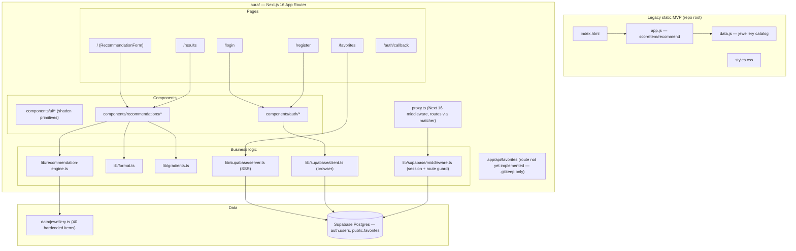

# System Overview Diagrams — Jewellery Age Advisor (Aura)

Extracted from `docs/architecture/current/00-system-overview.md` for quick visual review.

---

## System Architecture Diagram

```mermaid
flowchart TB
  subgraph Legacy["Legacy static MVP (repo root)"]
    HTML[index.html]
    JS[app.js — scoreItem/recommend]
    DATA_JS[data.js — jewellery catalog]
    CSS[styles.css]
    HTML --> JS
    JS --> DATA_JS
  end

  subgraph AuraApp["aura/ — Next.js 16 App Router"]
    subgraph Pages["Pages"]
      Home["/ (RecommendationForm)"]
      Results["/results"]
      Favorites["/favorites"]
      Login["/login"]
      Register["/register"]
      AuthCallback["/auth/callback"]
    end

    subgraph Components["Components"]
      UIPrim["components/ui/* (shadcn primitives)"]
      AuthComp["components/auth/*"]
      RecComp["components/recommendations/*"]
    end

    subgraph Lib["Business logic"]
      RecEngine["lib/recommendation-engine.ts"]
      Format["lib/format.ts"]
      Gradients["lib/gradients.ts"]
      SupaClient["lib/supabase/client.ts (browser)"]
      SupaServer["lib/supabase/server.ts (SSR)"]
      SupaMw["lib/supabase/middleware.ts (session + route guard)"]
    end

    Proxy["proxy.ts (Next 16 middleware, routes via matcher)"]
    APIFav["app/api/favorites (route not yet implemented — .gitkeep only)"]

    Home --> RecComp
    Results --> RecComp
    RecComp --> RecEngine
    RecComp --> Format
    RecComp --> Gradients
    Login --> AuthComp
    Register --> AuthComp
    AuthComp --> SupaClient
    Favorites --> SupaServer
    Proxy --> SupaMw
  end

  subgraph Data["Data"]
    StaticData["data/jewellery.ts (40 hardcoded items)"]
    Supabase[(Supabase Postgres — auth.users, public.favorites)]
  end

  RecEngine --> StaticData
  SupaServer --> Supabase
  SupaClient --> Supabase
  SupaMw --> Supabase
```
