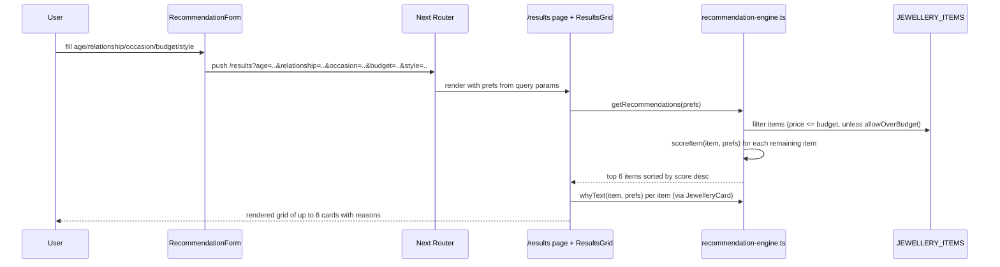
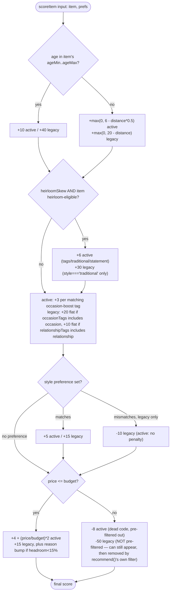

# Recommendation Engine Deep-Dive Diagrams

Extracted from `docs/architecture/current/01-recommendation-engine-deep-dive.md` for quick visual review.

---

## Sequence: Get Recommendations (active `aura/` implementation)

---

## Flow: Score a Single Item (active vs. legacy side-by-side)

