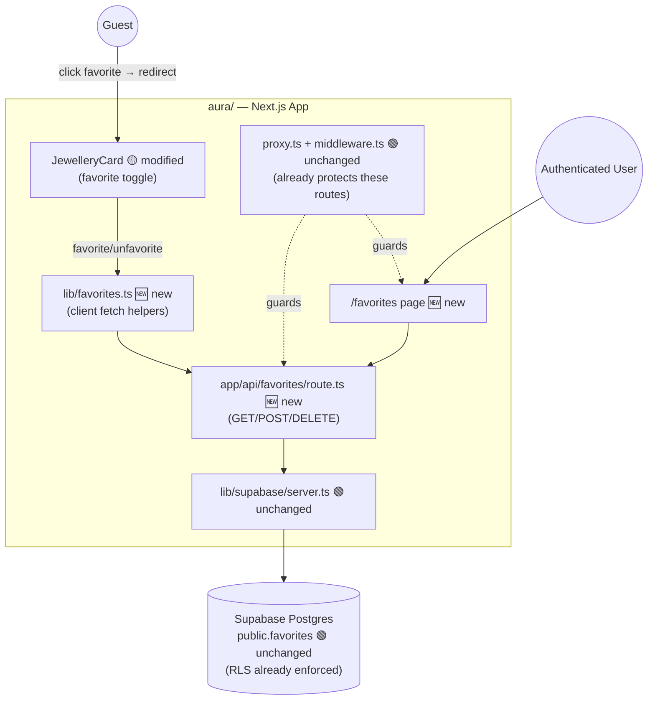
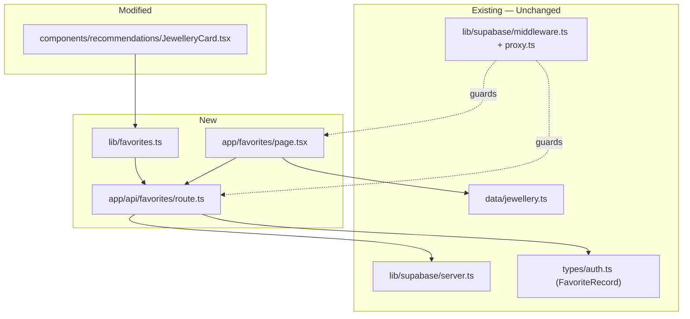
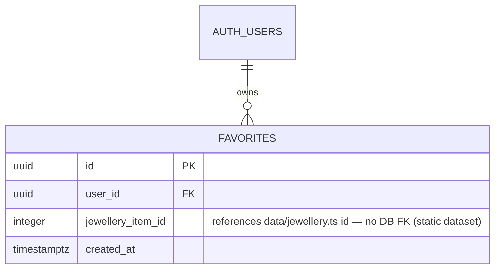
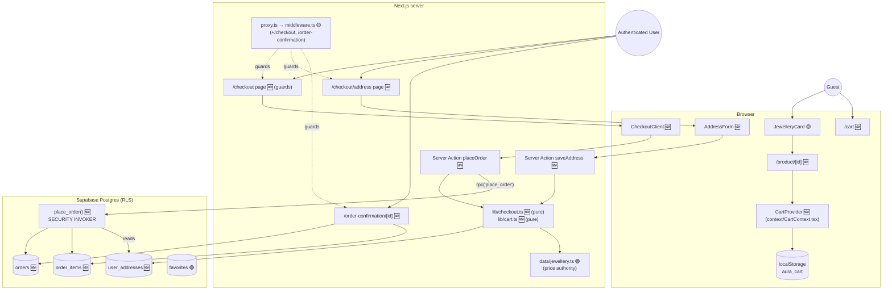
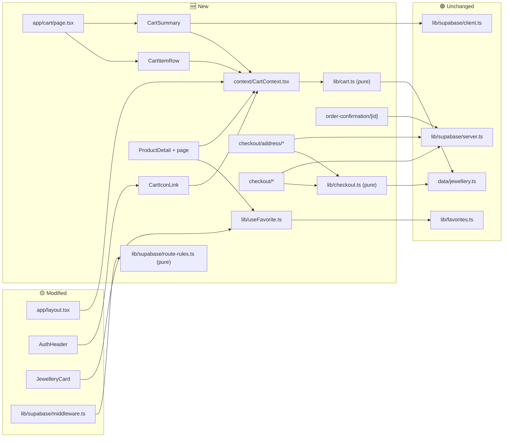
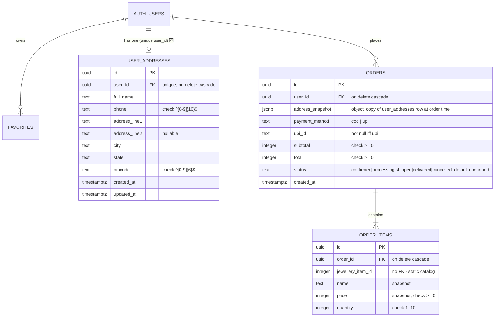

# Target Architecture Diagrams - Jewellery Age Advisor (Aura) — Favorites Completion

**Source**: `docs/architecture/design/02-target-architecture-brownfield.md`
**Generated**: 2026-09-29

> Mermaid diagrams extracted from the target architecture document for easy preview.

---

## Target System Context Diagram



---

## Component Architecture (Target)



---

## Data Model Changes



---
---

# Epic 10 — Aura Shopping Flow — Target Architecture Diagrams

**Source**: `docs/architecture/design/02-target-architecture-brownfield.md` (Epic 10 section)
**Generated**: 2026-10-08

> Mermaid diagrams extracted from the target architecture document for easy preview.

## 10.4 Target System Context



## 10.5 Component Architecture (Target)



## 10.6 Data Architecture



## 10.16 Order Placement Sequence

```mermaid
sequenceDiagram
  actor U as Authenticated User
  participant C as CheckoutClient (browser)
  participant A as Server Action placeOrder
  participant L as lib/checkout.ts + data/jewellery.ts
  participant D as Postgres place_order() [one transaction]
  U->>C: click Place Order (ref lock + disabled)
  C->>A: { paymentMethod, upiId?, items:[{id,quantity}] }
  A->>A: getUser() (reject if none)
  A->>L: validate + price from catalog (reject unknown id / bad qty / empty)
  L-->>A: priced lines, subtotal
  A->>D: rpc(p_payment_method, p_upi_id, p_items)
  D->>D: auth.uid(), validate, read user_addresses, insert orders + order_items
  alt success
    D-->>A: order id
    A-->>C: { ok: true, orderId }
    C->>C: clearCart()
    C->>U: router.push(/order-confirmation/orderId)
  else any failure
    D-->>A: exception (rolled back, no rows)
    A-->>C: { ok: false, safe message }
    C->>U: Alert; cart kept
  end
```
