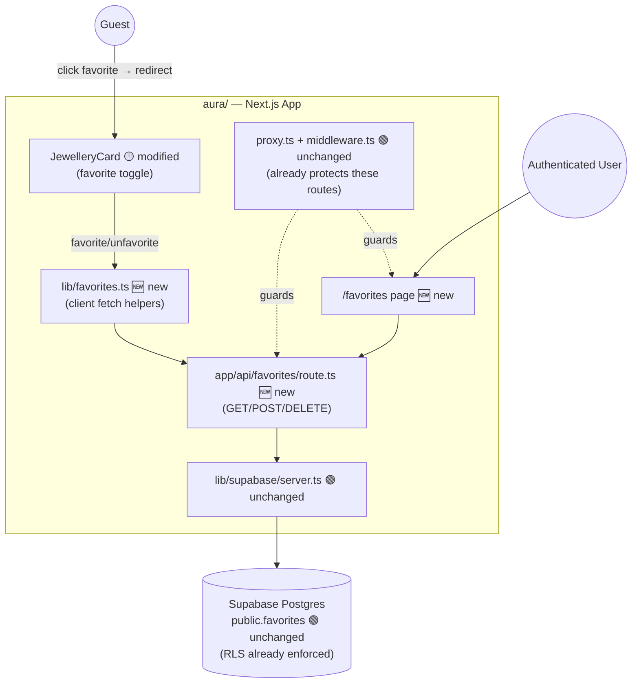
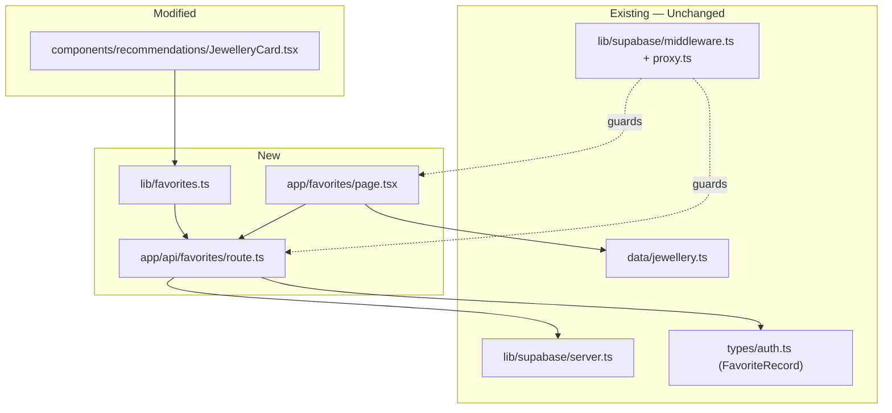
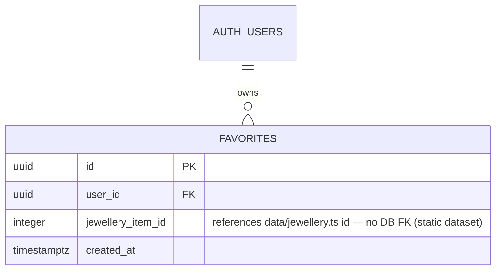

# Target Architecture Diagrams - Jewellery Age Advisor (Aura) — Favorites Completion

**Source**: `docs/architecture/design/02-target-architecture-brownfield.md`
**Generated**: 2026-09-29

> Mermaid diagrams extracted from the target architecture document for easy preview.

---

## Target System Context Diagram

---

## Component Architecture (Target)

---

## Data Model Changes

