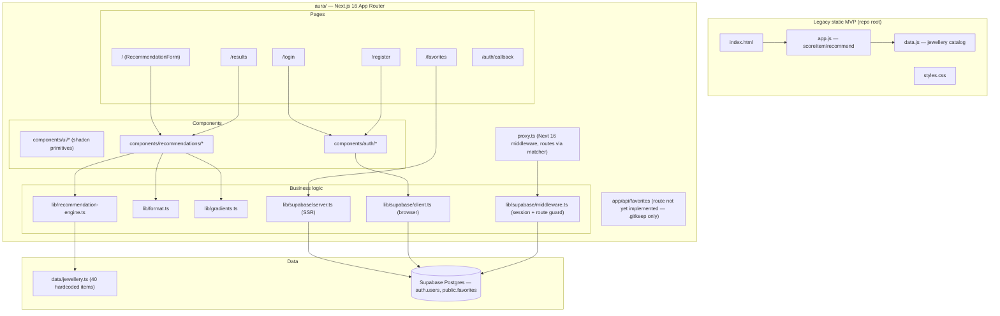

# System Overview - Jewellery Age Advisor (Aura)

**Date**: 2026-09-29
**Analyzed By**: ARCHITECT
**Status**: Draft

---

## Executive Summary

Aura recommends jewellery items to a user based on the recipient's age, relationship, occasion,
budget, and style, using a deterministic weighted-scoring heuristic (no ML/LLM call). The
repository currently contains **two parallel implementations**: a static HTML/CSS/JS MVP at the
repo root (the original, still-live scoring logic in `app.js`), and an in-progress Next.js 16 /
React 19 / Supabase rebuild under `aura/` (favorites, auth, and a ported — but intentionally
divergent — recommendation engine). The Next.js app is the active development target; the root
static app is legacy/reference.

---

## System Architecture

### Architecture Diagram

### Architecture Style

Server-rendered monolith (Next.js App Router) with a client-side deterministic recommendation
heuristic and a managed BaaS (Supabase) for auth + one relational table (`favorites`). No custom
backend API layer — Supabase is accessed directly from server/browser clients and via
`@supabase/ssr` in middleware. The legacy sibling app is a fully static, dependency-free
client-only heuristic app with no backend at all.

---

## Technology Stack

| Category | Technology | Version | Notes |
|----------|------------|---------|-------|
| Language | TypeScript | ^5 | `aura/` app only; root legacy app is plain JS/HTML/CSS |
| Framework | Next.js | 16.3.6 | App Router; middleware file renamed `proxy.ts` per Next 16 convention |
| UI Library | React | 19.2.8 | |
| Styling | Tailwind CSS | ^4 | Theme tokens added Epic 3 (`aura-*` design tokens, e.g. `rounded-aura-xl`, `border-border-soft`) |
| Component Primitives | shadcn/ui + `@base-ui/react` | ^4.21 / ^1.8 | `components/ui/*` |
| Icons | lucide-react | ^1.48 | |
| Backend-as-a-Service | Supabase (`@supabase/ssr`, `@supabase/supabase-js`) | ^0.12 / ^2.117 | Auth + Postgres; SSR cookie-based session |
| Testing | Vitest | ^4.1 | Only one test file exists: `lib/recommendation-engine.test.ts` |
| Linting | ESLint (`eslint-config-next`) | ^9 | |
| Legacy runtime | Vanilla JS / HTML / CSS | — | No build step, no dependencies |

---

## Module Overview

| Module | Path | Responsibility | Dependencies |
|--------|------|----------------|--------------|
| Legacy App | `/app.js`, `/index.html`, `/data.js`, `/styles.css` | Original static MVP: form → score → render recommendations, all client-side | None (no npm deps) |
| Pages (App Router) | `aura/app/*` | Routing, layout, page-level composition | Components, Lib |
| UI Primitives | `aura/components/ui/*` | Reusable shadcn-based visual primitives (Card, Button, Select, Slider, etc.) | `@base-ui/react`, `class-variance-authority` |
| Auth Components | `aura/components/auth/*` | Login/Registration forms, header, logout | `lib/supabase/client.ts` |
| Recommendation Components | `aura/components/recommendations/*` | Form, results grid, card, refilter bar | `lib/recommendation-engine.ts`, `lib/gradients.ts`, `lib/format.ts` |
| Recommendation Engine | `aura/lib/recommendation-engine.ts` | Age bracket / occasion / relationship scoring heuristic — **ported from a design doc, intentionally divergent from `app.js`'s live `scoreItem`** | `data/jewellery.ts`, `types/jewellery.ts` |
| Supabase Integration | `aura/lib/supabase/{client,server,middleware}.ts` | Browser client, SSR server client, session refresh + route protection | `@supabase/ssr` |
| Data | `aura/data/jewellery.ts` | 40 hardcoded catalog items (source of truth for the Next.js app) | `types/jewellery.ts` |
| Types | `aura/types/{jewellery,auth}.ts` | Shared domain types (`JewelleryItem`, `RecommendationPrefs`, `Relationship`, `Occasion`, etc.) | — |
| Database Migrations | `aura/supabase/migrations/0001_favorites.sql` | `favorites` table + RLS policies | Supabase Postgres |

---

## Entry Points

| Type | Path/Command | Description |
|------|--------------|--------------|
| Static HTML | `/index.html` | Legacy MVP entry point (open directly, no server) |
| Next.js dev server | `aura/` → `npm run dev` | Starts Next.js 16 dev server |
| Next.js build/start | `npm run build` / `npm run start` | Production build/serve |
| Root page | `aura/app/page.tsx` | `/` — recommendation form |
| Results page | `aura/app/results/page.tsx` | `/results` |
| Auth pages | `aura/app/login/page.tsx`, `aura/app/register/page.tsx`, `aura/app/auth/callback/route.ts` | Login, registration, OAuth/email callback |
| Favorites page | `aura/app/favorites/` | Protected route (guarded by `proxy.ts`) — page implementation present, but `app/api/favorites` route handler is **not yet implemented** (only `.gitkeep`) |
| Middleware | `aura/proxy.ts` | Session refresh + route protection on every matched request |
| Tests | `npm run test` (Vitest) | Runs `lib/recommendation-engine.test.ts` only |

---

## External Dependencies

### NPM Packages (Key)
| Package | Purpose |
|---------|---------|
| next | App framework / router / middleware |
| react, react-dom | UI rendering |
| @supabase/ssr, @supabase/supabase-js | Auth + Postgres client (browser, server, middleware) |
| @base-ui/react, shadcn, class-variance-authority | Component primitive layer |
| lucide-react | Icon set |
| tailwindcss, tw-animate-css | Styling |
| vitest | Test runner |

### External Services
| Service | Purpose | Integration |
|---------|---------|--------------|
| Supabase | Auth (email/OAuth) + Postgres (`favorites` table with RLS) | `@supabase/ssr` cookie-based session, direct table access from server/browser clients |
| picsum.photos | **Disabled** placeholder product images (Epic 4) | Was referenced via `imagePath`; currently short-circuited by `SHOW_PLACEHOLDER_IMAGES = false` in `JewelleryCard.tsx` — gradient fallback shown instead |

---

## Design References (Legacy Documentation)

**Location**: `SPEC/references/`

No files currently exist under `SPEC/references/builds` or `SPEC/references/devops` (directories
present but empty). No `docs/helix/INDEX.md` found. The Next.js code repeatedly cites an external
**"Migration Document"** (e.g. §1.3, §3.1, §3.3, §6, §9) as its build spec, but that document is
not present in this repository — it was evidently supplied out-of-band during a prior session and
is not committed. This is noted as a gap (see Areas of Concern).

---

## Test Infrastructure

| Type | Location | Framework | Coverage |
|------|----------|-----------|----------|
| Unit | `aura/lib/recommendation-engine.test.ts` | Vitest | Only the recommendation engine is tested; no component, page, auth, or Supabase-integration tests exist |

---

## Configuration

| File | Purpose |
|------|---------|
| `aura/next.config.ts` | Next.js build config |
| `aura/tsconfig.json` | TypeScript config |
| `aura/eslint.config.mjs` | Lint rules |
| `aura/postcss.config.mjs` | Tailwind/PostCSS pipeline |
| `aura/components.json` | shadcn/ui component generator config |
| `aura/vitest.config.mts` | Test runner config |
| Environment vars (implicit) | `NEXT_PUBLIC_SUPABASE_URL`, `NEXT_PUBLIC_SUPABASE_ANON_KEY` — read directly in `lib/supabase/{client,server,middleware}.ts`; no `.env.example` found in `aura/` |
| `aura/supabase/README.md` | Supabase setup notes |

---

## Key Observations

### Strengths
- Clear separation of concerns in the Next.js app: types, data, lib (business logic), components, and Supabase integration are each isolated into their own directories.
- Route protection is centralized in one place (`proxy.ts` → `lib/supabase/middleware.ts`) rather than duplicated per-page.
- RLS is enabled on the one Supabase table that exists (`favorites`), with per-user policies for select/insert/delete.
- The team has been disciplined about leaving in-code breadcrumbs explaining *why* something diverges from a spec (e.g. `proxy.ts` renamed from `middleware.ts`, the recommendation engine's intentional divergence from `app.js`).

### Areas of Concern
- **Two live recommendation engines with different logic**: the root `app.js` `scoreItem`/`recommend` implementation and `aura/lib/recommendation-engine.ts` are explicitly *not* equivalent (see engine file's own comment citing "Migration Document §9 item 10"). Anyone maintaining "the" scoring logic needs to know which one is authoritative going forward — currently undocumented as a formal decision.
- **`app/api/favorites` is unimplemented** — only a `.gitkeep` file exists, yet the favorites table, RLS policies, and a protected `/favorites` page all exist. The favorites feature is not functionally complete end-to-end.
- **Referenced "Migration Document" is not in the repo** — several files cite specific section numbers (§1.3, §3.1, §3.3, §6, §9) from a document that isn't checked in anywhere under `SPEC/references/` or `docs/`. This is a traceability gap: future changes can't verify against the actual spec.
- **No `.env.example`** in `aura/` — the two required Supabase env vars are only discoverable by reading `lib/supabase/*.ts` source.
- **Test coverage is minimal** — a single unit test file covers only the recommendation engine; no tests exist for auth flow, middleware route protection, favorites, or any UI component.
- **Placeholder images disabled, not resolved** — all 40 catalog images are non-jewellery stock photos from picsum.photos; currently masked with a gradient fallback rather than replaced (tracked in `aura/public/images/jewellery/CREDITS.md`).
- **No formal AIRE artifacts existed prior to this inspection** — `docs/plans/builds`, `docs/plans/stories`, and `docs/status.md` were all empty/absent; the six "Epic" commits were implemented without going through `aire-greenfield-requirements` / `aire-greenfield-architecture` / `aire-build-cycles`, so no requirements or architecture document exists to verify the current code against.

### Technical Debt
- Legacy static app (`index.html`/`app.js`/`data.js`/`styles.css`) still lives at the repo root with no documented decommission plan — unclear if it should be deleted, archived, or kept as a fallback.
- Divergence between the two recommendation engines (root vs. `aura/`) needs an explicit decision recorded (which is authoritative, and whether the legacy one should be retired).
- `app/api/favorites` route handler needs implementation to make the already-migrated `favorites` table usable from the UI.
