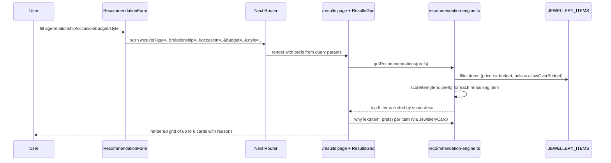
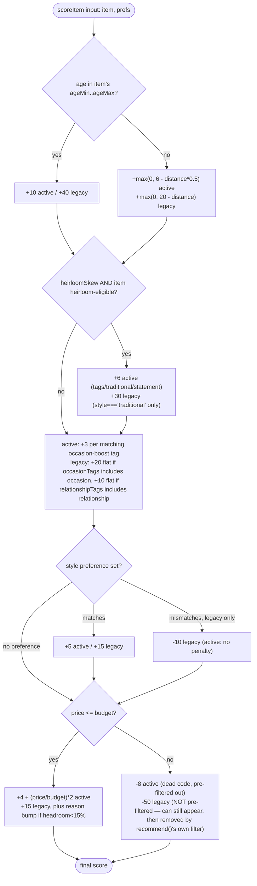

# Deep-Dive - Recommendation Engine

**Date**: 2026-09-29
**Analyzed By**: ARCHITECT
**Status**: Draft

---

## Module Overview

**Purpose**: Given a set of recipient preferences (age, relationship, occasion, budget, style),
score and rank the 40-item jewellery catalog to produce up to 6 recommendations plus a
human-readable "why" sentence per item.
**Path**: `aura/lib/recommendation-engine.ts` (active), `app.js` (legacy, still live at repo root)
**Key Files**: 2 implementations (99 lines TS active + 1 legacy JS scoring block ~80 lines),
1 test file (98 lines), 1 data file (40 items), 2 type files, 1 format helper file

---

## Component Breakdown

| Component | File | Responsibility |
|-----------|------|----------------|
| Recommendation engine (active) | `aura/lib/recommendation-engine.ts` | `ageBracket`, `heirloomSkew`, `occasionTagBoost`, `scoreItem`, `getRecommendations`, `whyText` |
| Recommendation engine (legacy) | `app.js` | `ageBracketFor`, `scoreItem`, `recommend`, plus DOM rendering (`renderResults`, form wiring) — scoring and UI are not separated |
| Catalog data | `aura/data/jewellery.ts` | 40 hardcoded `JewelleryItem` records, ported from `data.js` |
| Domain types | `aura/types/jewellery.ts` | `JewelleryItem`, `JewelleryCategory`, `JewelleryStyle`, `Relationship`, `Occasion`, `RecommendationPrefs` |
| Format helpers | `aura/lib/format.ts` | `formatINR`, `capitalize`, `relationshipLabel`, `relationshipTone` |
| Form component | `aura/components/recommendations/RecommendationForm.tsx` | Collects prefs, pushes them as URL query params to `/results` |
| Results grid | `aura/components/recommendations/ResultsGrid.tsx` | Calls `getRecommendations(prefs)`, renders cards |
| Refilter bar | `aura/components/recommendations/RefilterBar.tsx` | Client-side budget/style refinement via URL param mutation (server component `/results` page re-reads params and re-scores — not shown in this deep-dive scope, but implied by `router.replace`) |
| Card | `aura/components/recommendations/JewelleryCard.tsx` | Renders one item + calls `whyText` |
| Unit tests | `aura/lib/recommendation-engine.test.ts` | Covers `heirloomSkew`, `getRecommendations`, `scoreItem`, `whyText` — engine only, no component/integration tests |

---

## Key Workflows

### Workflow: Get Recommendations (active `aura/` implementation)



**Stories**:
1. As a user, I submit recipient details and see up to 6 ranked jewellery recommendations.
2. As a user, I see a one-line "why this pick" explanation on each recommended item.
3. As a user, I can refine budget/style on the results page without resubmitting the whole form (via `RefilterBar` mutating URL params).

### Workflow: Score a Single Item (both implementations, side-by-side)



---

## Data Models

### Entity: JewelleryItem (`aura/types/jewellery.ts`)

| Field | Type | Constraints | Description |
|-------|------|-------------|-------------|
| id | number | unique, 1–40 | Catalog identifier |
| name | string | — | Display name |
| category | JewelleryCategory | one of 10 values (`Ring`, `Necklace`, `Earrings`, `Bracelet`, `Bangle`, `Anklet`, `Pendant`, `Set`, `Chain`, `Hair Jewellery`) | Product category — `Hair Jewellery` was added beyond the Migration Document's original list to correctly categorize item 37 |
| price | number | INR, integer | Used directly in budget filtering/scoring |
| ageMin, ageMax | number | — | Inclusive age-fit range |
| style | JewelleryStyle | `minimal` \| `traditional` \| `statement` \| `modern` | Used for style-match scoring and heirloom eligibility |
| tags | string[] | — | Union of occasion + relationship keywords (flat list, no distinction between the two categories — differs from legacy's split `occasionTags`/`relationshipTags`) |
| imagePath | string | — | Currently unused in UI — `SHOW_PLACEHOLDER_IMAGES = false` in `JewelleryCard.tsx` |
| imageAlt | string | — | Accessibility text |

### Entity: RecommendationPrefs (`aura/types/jewellery.ts`)

| Field | Type | Description |
|-------|------|-------------|
| age | number | Recipient age |
| relationship | Relationship | `self`\|`daughter`\|`mother`\|`wife`\|`friend`\|`sister` |
| occasion | Occasion | `birthday`\|`wedding`\|`anniversary`\|`festival`\|`everyday`\|`graduation` |
| budget | number | INR ceiling |
| style | JewelleryStyle \| "" | Optional style preference |

No database involved in this module — the catalog is a static in-memory TypeScript array
(`JEWELLERY_ITEMS`), not a table. No ER diagram applies.

---

## Pattern Extraction

### Divergence Pattern: Two authoritative scoring implementations

**Observed** (not a recommended pattern — flagged as technical debt): `aura/lib/recommendation-engine.ts`
and `app.js` both implement age/heirloom/occasion/style/budget scoring, but with materially
different weights, thresholds, and tag models, and the divergence is **intentional and
documented in-code**, citing an external "Migration Document" not present in this repo:

```typescript
// aura/lib/recommendation-engine.ts (lines 5-9)
// Ported per Migration Document §1.3. NOTE (Epic 6): the document's design
// (this file) diverges from the real -jewellery-age-advisor/app.js, which
// uses a different scoreItem/recommend implementation entirely — see
// Migration Document §9 item 10. Per explicit instruction, Epic 4 and this
// epic follow the document's schema/design, not the live code.
```

Concrete differences:

| Aspect | `aura/` (active) | `app.js` (legacy) |
|---|---|---|
| Age-in-range score | +10 | +40 |
| Age-out-of-range decay | `6 - distance*0.5` | `20 - distance` |
| Heirloom eligibility | tags include `"heirloom"` OR style is `traditional`/`statement` | style is exactly `traditional` |
| Heirloom boost | +6 | +30 |
| Occasion/relationship tag model | single flat `tags[]`, occasion-only boost table (+3/tag) | separate `occasionTags`/`relationshipTags` arrays, flat +20/+10 |
| Style mismatch | no penalty | −10 |
| Budget fit bonus | `4 + (price/budget)*2` | flat 15 + reason text if headroom < 15% |
| Over-budget items reachable? | No — filtered out before scoring (dead `-8` branch) | Yes — scored with −50, then filtered out in `recommend()`'s own separate filter step |
| Output shape | `JewelleryItem[]` only | `{ item, score, reason }[]`, reason text generated inline during scoring |

**Recommendation**: This is the single most important gap this deep-dive surfaces — see Areas of
Concern in the system overview. A formal decision is needed on which engine is authoritative
going forward, and whether `app.js`/`index.html`/`data.js`/`styles.css` should be archived once
that's settled. This should be captured explicitly in `aire-brownfield-requirements`.

### Pattern: Deterministic, framework-free scoring function

**Pattern**: Pure functions, no I/O, fully unit-testable, sorted + sliced for a fixed-size result set.

**Example (from `aura/lib/recommendation-engine.ts:104-116`)**:
```typescript
// DO: pure function, explicit inputs, no hidden state
export function getRecommendations(
  prefs: RecommendationPrefs,
  allowOverBudget = false,
  items: JewelleryItem[] = JEWELLERY_ITEMS
): JewelleryItem[] {
  const pool = allowOverBudget ? items : items.filter((item) => item.price <= prefs.budget);
  return pool
    .map((item) => ({ item, score: scoreItem(item, prefs) }))
    .sort((a, b) => b.score - a.score)
    .slice(0, 6)
    .map((r) => r.item);
}

// DON'T (legacy app.js:75-81): mixes scoring, reason-text generation, and
// filtering in one function with no injectable item list — harder to test
// in isolation, and the reason list ends up threaded through the return type.
function recommend(criteria, items, limit = 6) {
  return items
    .map((item) => ({ item, ...scoreItem(item, criteria) }))
    .filter((r) => r.item.price <= criteria.budget)
    .sort((a, b) => b.score - a.score)
    .slice(0, limit);
}
```

### Pattern: Server-driven state via URL search params (no client state store)

**Pattern**: `RecommendationForm` writes prefs into the URL; `/results` (server-rendered) reads
them back; `RefilterBar` mutates params via `router.replace` rather than local React state,
so the results page is always derivable from the URL alone.

**Example (from `RecommendationForm.tsx:52-62`)**:
```typescript
// DO: encode all prefs into the URL so /results is a pure function of its query string
function handleSubmit(e: React.FormEvent) {
  e.preventDefault();
  const params = new URLSearchParams({ age: String(age), relationship, occasion, budget: String(budget), style });
  router.push(`/results?${params.toString()}`);
}
```
No DON'T counterpart exists in this codebase for this pattern — it's used consistently across
`RecommendationForm` and `RefilterBar`.

### Naming Conventions

- Engine functions are verbs/predicates: `scoreItem`, `getRecommendations`, `ageBracket`,
  `heirloomSkew`, `occasionTagBoost`, `whyText`, `isHeirloomEligible` (private, lowercase-first,
  not exported).
- Legacy `app.js` mixes camelCase function names with DOM-ID string literals
  (`"results-grid"`, `"advisor-form"`) — no naming pattern to port forward since there's no DOM
  layer in the Next.js app.

### Testing Patterns

**Location**: co-located with source — `aura/lib/recommendation-engine.test.ts` next to
`aura/lib/recommendation-engine.ts` (not a separate `tests/` tree).
**Framework**: Vitest, `describe`/`it`/`expect`.
**Notable pattern — locked regression baseline**:

```typescript
// DO: pin a known-good ordering as a regression guard, with an explicit
// comment telling future maintainers this must change deliberately, not silently
it("is deterministic for a fixed input (regression baseline)", () => {
  const results = getRecommendations(basePrefs);
  // Locked baseline for age 34 / wife / wedding / budget 200000 / no style
  // preference against the Epic 4 dataset — update deliberately if the
  // engine or dataset changes, not silently.
  expect(results.map((item) => item.id)).toEqual([16, 17, 18, 37, 36, 19]);
});
```

**Gap**: only the engine (`scoreItem`, `getRecommendations`, `heirloomSkew`, `whyText`) is
tested. No tests exist for `RecommendationForm`, `ResultsGrid`, `RefilterBar`, or `JewelleryCard`
— the URL-param round-trip and refilter behavior are entirely unverified by automated tests.

---

## Entry Points

| Entry | Path | Method | Description |
|-------|------|--------|-------------|
| Form submit | `/` → `/results?age=&relationship=&occasion=&budget=&style=` | client navigation (`router.push`) | Encodes prefs into query string |
| Results render | `/results` | GET (Next.js page render) | Reads query params → builds `RecommendationPrefs` → `ResultsGrid` calls `getRecommendations` |
| Refilter | `/results?...` (same route) | client navigation (`router.replace`) | `RefilterBar` mutates `budget`/`style` params in place |
| Legacy form submit | `#advisor-form` submit event | DOM event (no route) | Legacy app: `recommend()` called directly, results rendered into `#results-grid` |

---

## Recommendations

1. **Resolve the dual-engine divergence formally** in `aire-brownfield-requirements` — decide
   whether `aura/lib/recommendation-engine.ts`'s weights/rules are the accepted target behavior,
   and if so, schedule removal or clear archival of the legacy `app.js`/`index.html`/`data.js`
   path so there is exactly one authoritative implementation.
2. **Recover or reconstruct the "Migration Document"** referenced throughout this module
   (§1.3, §9 item 10, §1.5) — it's cited as the source of truth for scoring weights and tag
   maps but isn't in the repo. Without it, future changes to scoring can't be checked against
   the original intent.
3. **Add component/integration test coverage** for `RecommendationForm` → URL params →
   `ResultsGrid` → `getRecommendations` → `JewelleryCard` round-trip, and for `RefilterBar`'s
   param mutation — currently only the pure engine functions are tested.
4. **Clarify the dead `-8` branch** in `scoreItem` (over-budget path) — confirm it should stay
   as inert-but-faithful-to-spec code, or be removed now that its unreachability is understood.
