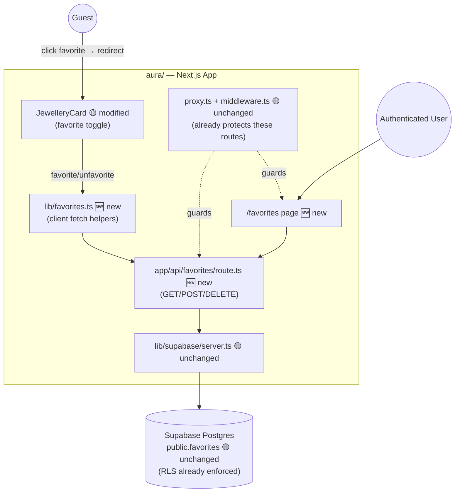
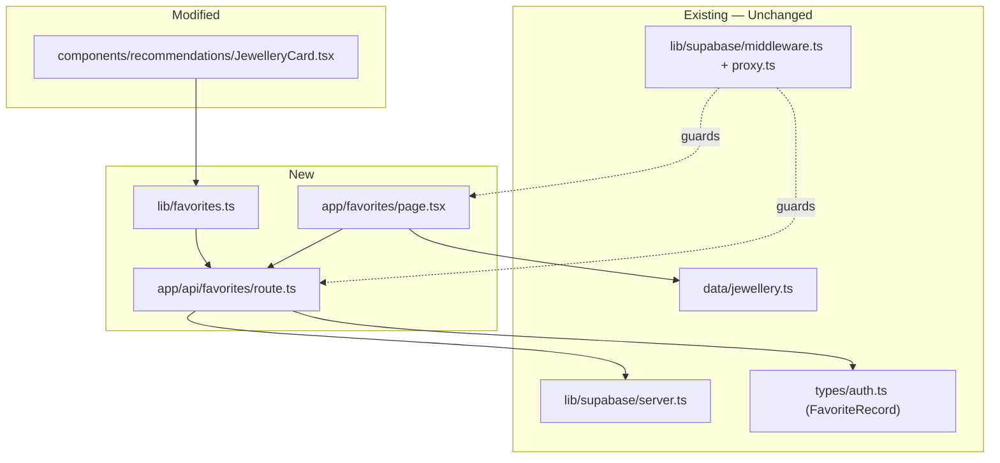
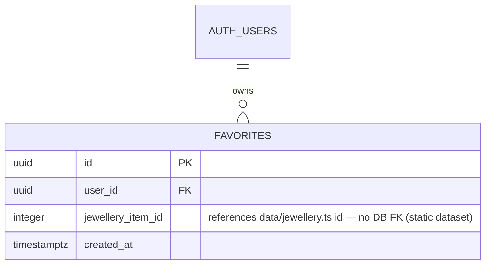

# Target Architecture - Jewellery Age Advisor (Aura) — Favorites Completion

**Date**: 2026-09-29
**Author**: ARCHITECT
**Status**: Approved
**Version**: 1.0
**Based On**: `docs/architecture/current/00-system-overview.md`, `docs/architecture/current/01-recommendation-engine-deep-dive.md`, `docs/requirements.md`, `SPEC/references/Aura-Migration-Document-Vanilla-JS-Next.jsTypeScriptSupabase.pdf` (§2, §3.3, §5, §8 Step 6)

---

## Overview

### Current System
Aura is a Next.js 16 App Router app with a client-side deterministic recommendation heuristic
and Supabase for auth + one table (`public.favorites`, with RLS already in place). The favorites
*data layer* was built in Epic 2, but the *feature* was never finished: no API route exists to
read/write it, and no page renders it. `aura/app/api/favorites/` and `aura/app/favorites/` each
contain only a `.gitkeep` file — this deep-dive found no `page.tsx` in either directory
(correcting an inaccuracy in the initial system overview, which assumed the favorites page existed).

### What We Are Changing
Completing the favorites feature exactly as specified in the Migration Document (§2 target file
tree, §5 component table, §8 Step 6): a protected API route (`GET`/`POST`/`DELETE`), a favorite
toggle on `JewelleryCard`, and a protected `/favorites` page that lists the user's saved items.

### Architecture Approach
Same architecture style, extended — no new pattern introduced. This follows the existing
functional/lib-based structure (not a formal domain/application/infrastructure split — `aura/`
has never used that layering, and introducing it now for one small feature would be inconsistent
with every other module). The new Route Handler uses the same `lib/supabase/server.ts` pattern
already used by `AuthHeader`; the new client-side toggle follows the same `"use client"` +
`lib/supabase/client.ts` pattern already used by `LoginForm`/`RegistrationForm`/`LogoutButton`.

---

## Delta Summary

| Component | Status | Change Description |
|-----------|--------|--------------------|
| `public.favorites` table + RLS | 🟢 Unchanged | Already correct (Epic 2, Migration Doc §3.3) — no migration needed |
| `lib/supabase/server.ts` | 🟢 Unchanged | Reused as-is by the new route handler |
| `lib/supabase/middleware.ts` / `proxy.ts` | 🟢 Unchanged | Already protects `/favorites` and `/api/favorites` (Epic 5) |
| `app/api/favorites/route.ts` | 🆕 New | `GET` (list current user's favorites), `POST` (add), `DELETE` (remove) |
| `types/auth.ts` (`FavoriteRecord`) | 🟢 Unchanged | Already defined per Migration Doc §3.2 — reused by the new route |
| `lib/favorites.ts` | 🆕 New | Thin client-side fetch helpers (`addFavorite`, `removeFavorite`, `listFavorites`) so `JewelleryCard` and the favorites page don't duplicate fetch/error-handling logic |
| `components/recommendations/JewelleryCard.tsx` | 🟡 Modified | Add a favorite-toggle control; redirect to `/login` if logged out, else call the new route |
| `app/favorites/page.tsx` | 🆕 New | Protected page — Server Component fetches the user's favorites + resolves them against `data/jewellery.ts`, renders the same card grid style as `/results` |
| `data/jewellery.ts` | 🟢 Unchanged | Read-only lookup by `id` for favorited items — no schema change |

---

## Technology Stack

| Category | Technology | Version | Status | Notes |
|----------|------------|---------|--------|-------|
| Route Handlers | Next.js App Router | 16.3.6 | 🟢 Unchanged | Standard `app/api/*/route.ts` convention, already used elsewhere in the framework (just not yet in this app) |
| Data access | `@supabase/supabase-js` via `lib/supabase/server.ts` | ^2.117 | 🟢 Unchanged | Same server client already used by `AuthHeader` |
| Auth check | `supabase.auth.getUser()` | — | 🟢 Unchanged | Same pattern already used in `lib/supabase/middleware.ts` and `AuthHeader` |

✅ No new technology required — all changes use the existing stack.

---

## Target System Context



---

## Component Architecture (Target)



---

## Data Model Changes

No schema changes. `public.favorites` (Epic 2, Migration Doc §3.3) already has the correct shape
and RLS policies for this feature:



### Migration Plan

None required — table and RLS policies already exist and are correct. `jewellery_item_id` remains
a plain integer with no DB foreign key, per the Migration Document's own §3.2 note (the dataset is
a static file, not a table).

---

## API Changes

### New Endpoints

All three require an authenticated session (enforced by `proxy.ts`/`middleware.ts` already, plus
the route handler independently checks `supabase.auth.getUser()` as defense-in-depth — matching
the Migration Document §4.4's "also enforced server-side by RLS as defense-in-depth, not just
middleware" principle).

| Method | Path | Description | Auth |
|--------|------|--------------|------|
| GET | `/api/favorites` | List the current user's favorite `jewellery_item_id`s (and/or resolved `JewelleryItem[]`) | Session cookie (Supabase) |
| POST | `/api/favorites` | Add a favorite. Body: `{ jewelleryItemId: number }` | Session cookie |
| DELETE | `/api/favorites` | Remove a favorite. Body or query: `{ jewelleryItemId: number }` | Session cookie |

**Request/response contracts:**

```typescript
// GET /api/favorites
// Success (200): FavoriteRecord[] — as defined in types/auth.ts, unchanged
// Unauthenticated (401): { error: "Unauthorized" }

// POST /api/favorites
// Request body: { jewelleryItemId: number }
// Success (201): FavoriteRecord (the created row)
// Already favorited (409, since (user_id, jewellery_item_id) is unique): { error: "Already favorited" }
// Invalid id (400): { error: "Invalid jewelleryItemId" }
// Unauthenticated (401): { error: "Unauthorized" }

// DELETE /api/favorites
// Request body: { jewelleryItemId: number }
// Success (200): { removed: true }
// Not found (404): { error: "Favorite not found" }
// Unauthenticated (401): { error: "Unauthorized" }
```

No existing endpoints are modified — this repo has no other API routes today (`aura/app/api/`
contained only the empty `favorites` directory).

---

## Security Design

- **Authentication**: identical to the rest of the app — Supabase session cookie via `@supabase/ssr`,
  already refreshed on every request by `proxy.ts`. No new auth mechanism introduced.
- **Authorization model** (reconciled against `docs/requirements.md`'s Roles & Permissions Matrix):
  - Role **Authenticated User** — permissions `favorites:read-own`, `favorites:create-own`,
    `favorites:delete-own` — all **Existing** in the matrix already (no new role/permission introduced
    by this work; the matrix already anticipated exactly this feature).
  - Role **Guest** — explicitly denied all three; `JewelleryCard`'s toggle redirects to `/login`
    rather than attempting the call, and the route independently returns 401 if somehow reached.
- **Defense-in-depth**: even though `proxy.ts` already blocks unauthenticated requests to
  `/api/favorites` at the middleware layer, the route handler must also call
  `supabase.auth.getUser()` itself and return 401 if no user — this matches the existing pattern
  Migration Document §4.4 specifies ("also enforced server-side by RLS as defense-in-depth, not
  just middleware") and protects against any future middleware matcher misconfiguration.
- **Data protection**: RLS policies (`auth.uid() = user_id`) already enforce per-user isolation at
  the database level — the route handler must always query/mutate using the authenticated user's
  Supabase client (never a service-role client), so RLS applies to every query.
- **No new external integrations, no new secrets.**

---

## Error Handling

- **Error format**: JSON body `{ error: string }` with the appropriate HTTP status — this is a new
  convention (no prior API route existed to establish one), chosen to match Supabase's own client
  error shape (`{ message, code, ... }`) closely enough to be familiar, while staying a plain,
  minimal shape appropriate for a route with exactly 3 call sites (no framework needed).
- **Error categories**: 401 (unauthenticated), 400 (malformed `jewelleryItemId`), 404 (DELETE on a
  non-existent favorite), 409 (POST duplicate — surfaces the existing unique constraint rather than
  silently succeeding or 500ing).
- **Client-side (`lib/favorites.ts` + `JewelleryCard`)**: on any non-2xx response, surface a
  non-blocking inline state (e.g., toggle reverts, no page-breaking error) — consistent with the
  existing `RegistrationForm`/`LoginForm` pattern of inline `Alert` components rather than thrown
  exceptions bubbling to an error boundary.
- **Fallback behavior**: if `/favorites` page's fetch of favorites fails, render the existing
  "no pieces match" empty-state copy pattern adapted to favorites (e.g., "You haven't favorited
  anything yet") rather than a hard error — consistent with `ResultsGrid`'s empty-state handling.

## Observability

- No structured logging framework exists anywhere in `aura/` today (confirmed in deep-dive) — this
  feature should not introduce one unilaterally. Follow the existing (minimal) convention: rely on
  Next.js's own request logging in dev/production, no custom logger added.
- No metrics/alerting infrastructure exists in this repo — out of scope for this feature, consistent
  with the rest of the app.

---

## Technical Decisions

1. **Introduce `lib/favorites.ts` as a new file**, not explicitly named in the Migration Document.
   *Rationale*: both `JewelleryCard` (toggle) and `app/favorites/page.tsx` (list) need to call the
   same API; a shared helper avoids duplicating fetch/error handling, consistent with the existing
   `lib/format.ts` pattern of small shared helper modules. *Alternative considered*: inline `fetch`
   calls directly in each component — rejected as it would duplicate error-handling logic across
   two components for no benefit.
2. **Route handler independently checks auth** rather than trusting `proxy.ts` alone. *Rationale*:
   explicitly required by Migration Document §4.4's defense-in-depth principle, already the pattern
   used for `/favorites` and `/api/favorites` protection. *Alternative considered*: rely solely on
   RLS + middleware — rejected because the Migration Document explicitly calls out server-side
   auth checks as a separate, required layer, not an either/or with RLS.
3. **`GET /api/favorites` returns raw `FavoriteRecord[]`, not resolved `JewelleryItem[]`.**
   *Rationale*: keeps the route a thin data-access layer; resolving against `data/jewellery.ts`
   (a static import, not a DB call) is trivial and cheap to do in the Server Component
   (`app/favorites/page.tsx`) that already has both the favorite IDs and the full catalog in
   memory — avoids the route needing to import catalog data it doesn't otherwise touch.
   *Alternative considered*: resolve items server-side in the route — rejected as unnecessary
   coupling between the data-access route and the static catalog module.
4. **No new role/permission introduced.** The Roles & Permissions Matrix in `docs/requirements.md`
   already anticipated exactly this feature (`favorites:read-own`, `favorites:create-own`,
   `favorites:delete-own` on the existing "Authenticated User" role) — confirmed as still accurate,
   no update to that document needed.
