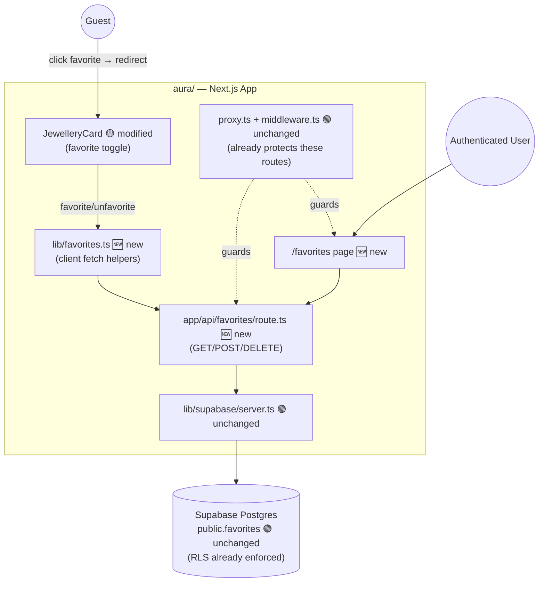
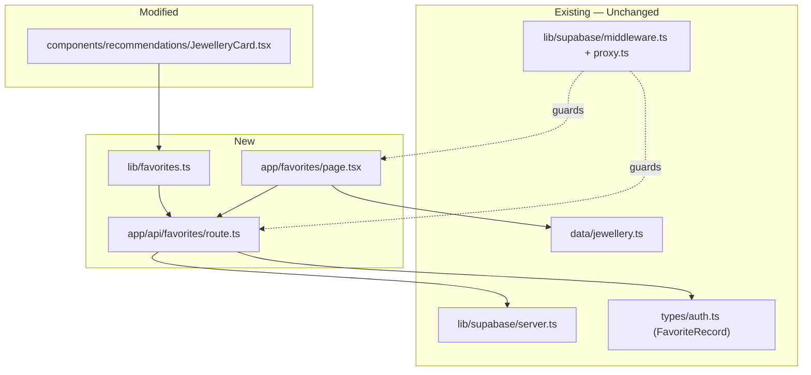
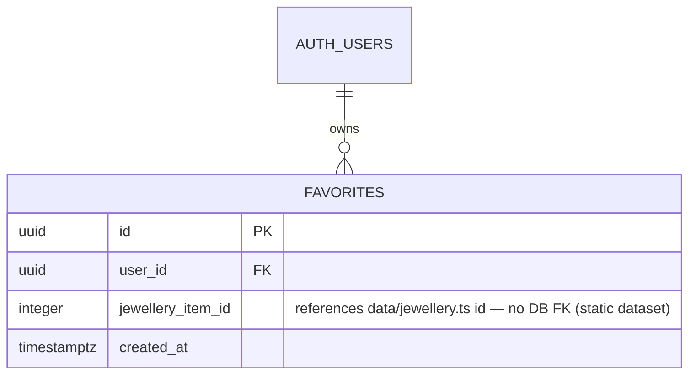
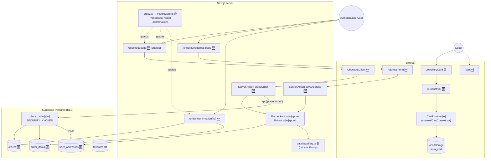
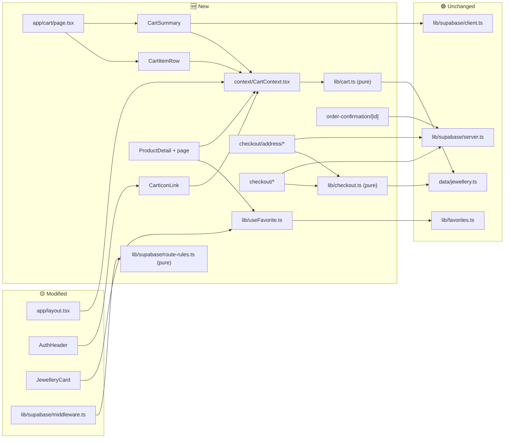
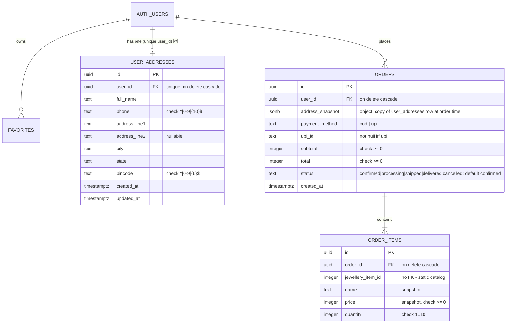

# Target Architecture - Jewellery Age Advisor (Aura) — Favorites Completion

**Date**: 2026-09-29
**Author**: ARCHITECT
**Status**: Approved
**Version**: 1.0
**Based On**: `docs/architecture/current/00-system-overview.md`, `docs/architecture/current/01-recommendation-engine-deep-dive.md`, `docs/requirements.md`, `SPEC/references/Aura-Migration-Document-Vanilla-JS-Next.jsTypeScriptSupabase.pdf` (§2, §3.3, §5, §8 Step 6)

---

## Overview

### Current System
Aura is a Next.js 16 App Router app with a client-side deterministic recommendation heuristic
and Supabase for auth + one table (`public.favorites`, with RLS already in place). The favorites
*data layer* was built in Epic 2, but the *feature* was never finished: no API route exists to
read/write it, and no page renders it. `aura/app/api/favorites/` and `aura/app/favorites/` each
contain only a `.gitkeep` file — this deep-dive found no `page.tsx` in either directory
(correcting an inaccuracy in the initial system overview, which assumed the favorites page existed).

### What We Are Changing
Completing the favorites feature exactly as specified in the Migration Document (§2 target file
tree, §5 component table, §8 Step 6): a protected API route (`GET`/`POST`/`DELETE`), a favorite
toggle on `JewelleryCard`, and a protected `/favorites` page that lists the user's saved items.

### Architecture Approach
Same architecture style, extended — no new pattern introduced. This follows the existing
functional/lib-based structure (not a formal domain/application/infrastructure split — `aura/`
has never used that layering, and introducing it now for one small feature would be inconsistent
with every other module). The new Route Handler uses the same `lib/supabase/server.ts` pattern
already used by `AuthHeader`; the new client-side toggle follows the same `"use client"` +
`lib/supabase/client.ts` pattern already used by `LoginForm`/`RegistrationForm`/`LogoutButton`.

---

## Delta Summary

| Component | Status | Change Description |
|-----------|--------|--------------------|
| `public.favorites` table + RLS | 🟢 Unchanged | Already correct (Epic 2, Migration Doc §3.3) — no migration needed |
| `lib/supabase/server.ts` | 🟢 Unchanged | Reused as-is by the new route handler |
| `lib/supabase/middleware.ts` / `proxy.ts` | 🟢 Unchanged | Already protects `/favorites` and `/api/favorites` (Epic 5) |
| `app/api/favorites/route.ts` | 🆕 New | `GET` (list current user's favorites), `POST` (add), `DELETE` (remove) |
| `types/auth.ts` (`FavoriteRecord`) | 🟢 Unchanged | Already defined per Migration Doc §3.2 — reused by the new route |
| `lib/favorites.ts` | 🆕 New | Thin client-side fetch helpers (`addFavorite`, `removeFavorite`, `listFavorites`) so `JewelleryCard` and the favorites page don't duplicate fetch/error-handling logic |
| `components/recommendations/JewelleryCard.tsx` | 🟡 Modified | Add a favorite-toggle control; redirect to `/login` if logged out, else call the new route |
| `app/favorites/page.tsx` | 🆕 New | Protected page — Server Component fetches the user's favorites + resolves them against `data/jewellery.ts`, renders the same card grid style as `/results` |
| `data/jewellery.ts` | 🟢 Unchanged | Read-only lookup by `id` for favorited items — no schema change |

---

## Technology Stack

| Category | Technology | Version | Status | Notes |
|----------|------------|---------|--------|-------|
| Route Handlers | Next.js App Router | 16.3.6 | 🟢 Unchanged | Standard `app/api/*/route.ts` convention, already used elsewhere in the framework (just not yet in this app) |
| Data access | `@supabase/supabase-js` via `lib/supabase/server.ts` | ^2.117 | 🟢 Unchanged | Same server client already used by `AuthHeader` |
| Auth check | `supabase.auth.getUser()` | — | 🟢 Unchanged | Same pattern already used in `lib/supabase/middleware.ts` and `AuthHeader` |

✅ No new technology required — all changes use the existing stack.

---

## Target System Context



---

## Component Architecture (Target)



---

## Data Model Changes

No schema changes. `public.favorites` (Epic 2, Migration Doc §3.3) already has the correct shape
and RLS policies for this feature:



### Migration Plan

None required — table and RLS policies already exist and are correct. `jewellery_item_id` remains
a plain integer with no DB foreign key, per the Migration Document's own §3.2 note (the dataset is
a static file, not a table).

---

## API Changes

### New Endpoints

All three require an authenticated session (enforced by `proxy.ts`/`middleware.ts` already, plus
the route handler independently checks `supabase.auth.getUser()` as defense-in-depth — matching
the Migration Document §4.4's "also enforced server-side by RLS as defense-in-depth, not just
middleware" principle).

| Method | Path | Description | Auth |
|--------|------|--------------|------|
| GET | `/api/favorites` | List the current user's favorite `jewellery_item_id`s (and/or resolved `JewelleryItem[]`) | Session cookie (Supabase) |
| POST | `/api/favorites` | Add a favorite. Body: `{ jewelleryItemId: number }` | Session cookie |
| DELETE | `/api/favorites` | Remove a favorite. Body or query: `{ jewelleryItemId: number }` | Session cookie |

**Request/response contracts:**

```typescript
// GET /api/favorites
// Success (200): FavoriteRecord[] — as defined in types/auth.ts, unchanged
// Unauthenticated (401): { error: "Unauthorized" }

// POST /api/favorites
// Request body: { jewelleryItemId: number }
// Success (201): FavoriteRecord (the created row)
// Already favorited (409, since (user_id, jewellery_item_id) is unique): { error: "Already favorited" }
// Invalid id (400): { error: "Invalid jewelleryItemId" }
// Unauthenticated (401): { error: "Unauthorized" }

// DELETE /api/favorites
// Request body: { jewelleryItemId: number }
// Success (200): { removed: true }
// Not found (404): { error: "Favorite not found" }
// Unauthenticated (401): { error: "Unauthorized" }
```

No existing endpoints are modified — this repo has no other API routes today (`aura/app/api/`
contained only the empty `favorites` directory).

---

## Security Design

- **Authentication**: identical to the rest of the app — Supabase session cookie via `@supabase/ssr`,
  already refreshed on every request by `proxy.ts`. No new auth mechanism introduced.
- **Authorization model** (reconciled against `docs/requirements.md`'s Roles & Permissions Matrix):
  - Role **Authenticated User** — permissions `favorites:read-own`, `favorites:create-own`,
    `favorites:delete-own` — all **Existing** in the matrix already (no new role/permission introduced
    by this work; the matrix already anticipated exactly this feature).
  - Role **Guest** — explicitly denied all three; `JewelleryCard`'s toggle redirects to `/login`
    rather than attempting the call, and the route independently returns 401 if somehow reached.
- **Defense-in-depth**: even though `proxy.ts` already blocks unauthenticated requests to
  `/api/favorites` at the middleware layer, the route handler must also call
  `supabase.auth.getUser()` itself and return 401 if no user — this matches the existing pattern
  Migration Document §4.4 specifies ("also enforced server-side by RLS as defense-in-depth, not
  just middleware") and protects against any future middleware matcher misconfiguration.
- **Data protection**: RLS policies (`auth.uid() = user_id`) already enforce per-user isolation at
  the database level — the route handler must always query/mutate using the authenticated user's
  Supabase client (never a service-role client), so RLS applies to every query.
- **No new external integrations, no new secrets.**

---

## Error Handling

- **Error format**: JSON body `{ error: string }` with the appropriate HTTP status — this is a new
  convention (no prior API route existed to establish one), chosen to match Supabase's own client
  error shape (`{ message, code, ... }`) closely enough to be familiar, while staying a plain,
  minimal shape appropriate for a route with exactly 3 call sites (no framework needed).
- **Error categories**: 401 (unauthenticated), 400 (malformed `jewelleryItemId`), 404 (DELETE on a
  non-existent favorite), 409 (POST duplicate — surfaces the existing unique constraint rather than
  silently succeeding or 500ing).
- **Client-side (`lib/favorites.ts` + `JewelleryCard`)**: on any non-2xx response, surface a
  non-blocking inline state (e.g., toggle reverts, no page-breaking error) — consistent with the
  existing `RegistrationForm`/`LoginForm` pattern of inline `Alert` components rather than thrown
  exceptions bubbling to an error boundary.
- **Fallback behavior**: if `/favorites` page's fetch of favorites fails, render the existing
  "no pieces match" empty-state copy pattern adapted to favorites (e.g., "You haven't favorited
  anything yet") rather than a hard error — consistent with `ResultsGrid`'s empty-state handling.

## Observability

- No structured logging framework exists anywhere in `aura/` today (confirmed in deep-dive) — this
  feature should not introduce one unilaterally. Follow the existing (minimal) convention: rely on
  Next.js's own request logging in dev/production, no custom logger added.
- No metrics/alerting infrastructure exists in this repo — out of scope for this feature, consistent
  with the rest of the app.

---

## Technical Decisions

1. **Introduce `lib/favorites.ts` as a new file**, not explicitly named in the Migration Document.
   *Rationale*: both `JewelleryCard` (toggle) and `app/favorites/page.tsx` (list) need to call the
   same API; a shared helper avoids duplicating fetch/error handling, consistent with the existing
   `lib/format.ts` pattern of small shared helper modules. *Alternative considered*: inline `fetch`
   calls directly in each component — rejected as it would duplicate error-handling logic across
   two components for no benefit.
2. **Route handler independently checks auth** rather than trusting `proxy.ts` alone. *Rationale*:
   explicitly required by Migration Document §4.4's defense-in-depth principle, already the pattern
   used for `/favorites` and `/api/favorites` protection. *Alternative considered*: rely solely on
   RLS + middleware — rejected because the Migration Document explicitly calls out server-side
   auth checks as a separate, required layer, not an either/or with RLS.
3. **`GET /api/favorites` returns raw `FavoriteRecord[]`, not resolved `JewelleryItem[]`.**
   *Rationale*: keeps the route a thin data-access layer; resolving against `data/jewellery.ts`
   (a static import, not a DB call) is trivial and cheap to do in the Server Component
   (`app/favorites/page.tsx`) that already has both the favorite IDs and the full catalog in
   memory — avoids the route needing to import catalog data it doesn't otherwise touch.
   *Alternative considered*: resolve items server-side in the route — rejected as unnecessary
   coupling between the data-access route and the static catalog module.
4. **No new role/permission introduced.** The Roles & Permissions Matrix in `docs/requirements.md`
   already anticipated exactly this feature (`favorites:read-own`, `favorites:create-own`,
   `favorites:delete-own` on the existing "Authenticated User" role) — confirmed as still accurate,
   no update to that document needed.

---
---

# Epic 10 — Aura Shopping Flow (Product Detail → Cart → Address → Secure Checkout)

**Date**: 2026-10-08
**Author**: ARCHITECT
**Status**: Approved (user, 2026-10-08)
**Version**: 2.0 (Epic 10 section; the Favorites Completion section above is unchanged and remains approved)
**Based On**: `docs/requirements.md` (Epic 10 section, approved 2026-10-08), `docs/helix/` (Helix solution 1080 snapshot 2026-10-08), `docs/architecture/current/00-system-overview.md`, `docs/architecture/current/01-recommendation-engine-deep-dive.md`, the `aura/` source read on 2026-10-08.

---

## 10.1 Overview

### Current System
Next.js 16 App Router monolith. Supabase handles auth + Postgres (RLS) through per-request server
clients (`lib/supabase/server.ts`) and a browser client. Business logic is pure functions in `lib/`
with co-located Vitest tests (node environment). The only data API is `app/api/favorites`; there are
no Server Actions, no React Context providers, and one migration (`0001_favorites.sql`).

### What We Are Changing
Add a purchase flow: product detail → cart (browser-local) → delivery address → checkout (COD / UPI
id capture) → order confirmation, with three new tables, one database function, and route
protection for the new private routes. 11 Helix stories (local 10.1–10.11) + approved hardening D1–D9.

### Architecture Approach
Same style, extended — no new architectural pattern except two additions the codebase has not used
before, both mandated by the approved requirements: **(1) Server Actions** for address save and order
placement, and **(2) a Postgres function (`place_order`)** for the atomic order write. Everything else
follows existing patterns: pure logic in `lib/` + tests, RLS as enforcement, `redirectedFrom` login
bounce, `Button render={<Link/>}`, design tokens. **No new npm dependency, no new env var, no service-role key.**

---

## 10.2 Delta Summary

| Component | Status | Change |
|-----------|--------|--------|
| `data/jewellery.ts`, `lib/recommendation-engine.ts`, `lib/favorites.ts`, `app/api/favorites/*`, `0001_favorites.sql` | 🟢 Unchanged | Must stay byte-for-byte (requirements failure criterion #5) |
| `lib/supabase/server.ts`, `client.ts` | 🟢 Unchanged | Reused |
| `lib/supabase/middleware.ts` | 🟡 Modified | `PROTECTED_PATHS` += `/checkout`, `/order-confirmation`; path test extracted to `lib/supabase/route-rules.ts` so it is unit-testable |
| `lib/supabase/route-rules.ts` | 🆕 New | `PROTECTED_PATHS`, `AUTH_ONLY_WHEN_LOGGED_OUT_PATHS`, `isProtectedPath()`, `isAuthOnlyPath()` (pure) |
| `app/layout.tsx` | 🟡 Modified | Wrap `<AuthHeader/>` + `{children}` in `<CartProvider>` |
| `components/auth/AuthHeader.tsx` | 🟡 Modified | Render `<CartIconLink/>` in the right-hand group (stays an async Server Component) |
| `components/recommendations/JewelleryCard.tsx` | 🟡 Modified | Wrap in `Link`; favorite state moved to `useFavorite` hook; behaviour otherwise identical |
| `lib/useFavorite.ts` | 🆕 New | `"use client"` hook extracted verbatim from `JewelleryCard` (auth check, `listFavorites`, optimistic toggle with rollback, login redirect preserving `redirectedFrom`) |
| `lib/cart.ts` | 🆕 New | Pure: `CartItem` type, `cartReducer`, `MAX_QTY`, `parseStoredCart()`, `serializeCart()`, `cartTotals()` |
| `context/CartContext.tsx` | 🆕 New | `CartProvider`, `useCart()`; hydration + persistence (StrictMode-safe), exposes `isHydrated` |
| `components/cart/{CartIconLink,CartItemRow,CartSummary}.tsx` | 🆕 New | Client components |
| `app/cart/page.tsx` | 🆕 New | Client page (public) |
| `app/product/[id]/{page,ProductDetail}.tsx` | 🆕 New | Server page (static, 40 params, `dynamicParams = false`) + client view |
| `lib/checkout.ts` | 🆕 New | Pure: address validation, UPI validation, `priceOrder()`, `isUuid()`, `shortOrderId()`, limits, result types |
| `types/address.ts` | 🆕 New | `UserAddress` (Helix 3.1) + `AddressInput` |
| `app/checkout/address/{page,AddressForm,actions}.ts(x)` | 🆕 New | Server page + client form + Server Action `saveAddress` |
| `app/checkout/{page,CheckoutClient,actions}.ts(x)` | 🆕 New | Guard page (10.9) extended (10.10) + client + Server Action `placeOrder` |
| `app/order-confirmation/[id]/page.tsx` | 🆕 New | Server page |
| `supabase/migrations/0002_user_addresses.sql` (+rollback) | 🆕 New | Table + RLS + CHECKs |
| `supabase/migrations/0003_orders.sql` (+rollback) | 🆕 New | Tables + RLS + CHECKs + indexes |
| `supabase/migrations/0004_place_order_fn.sql` (+rollback) | 🆕 New | `public.place_order()` function + grants |

## 10.3 Technology Stack

| Category | Technology | Status | Notes |
|----------|------------|--------|-------|
| Framework/UI | Next.js 16.3.6, React 19.2.8, Tailwind 4, Base UI/shadcn, lucide-react | 🟢 Unchanged | All required primitives already present (`alert`, `separator`, `input`, `label`, `button`, `card`) |
| Data | Supabase Postgres + `@supabase/ssr` | 🟢 Unchanged | New tables/function only |
| Tests | Vitest (node) | 🟢 Unchanged | No jsdom (D5) |

✅ No new technology required — all changes use the existing stack. **Alternatives considered and rejected**: `useSyncExternalStore` for the cart (more code, not needed), a cart table in Supabase (out of scope; guests need a cart), Stripe/UPI gateway (out of scope), `zod` for validation (new dependency — hand-written validators in `lib/checkout.ts` instead).

---

## 10.4 Target System Context



## 10.5 Component Architecture (Target)



**Layering rules** (match the existing functional style): `lib/*.ts` pure files import only `data/`, `types/`, other pure `lib` files — never `react`, `next/*` or Supabase. `lib/useFavorite.ts` is the only new `lib` file allowed to import React (it is a hook and is not unit-tested in node; its logic is a verbatim extraction, covered by QA). Server Actions import `lib/checkout.ts` + `lib/supabase/server.ts` only.

---

## 10.6 Data Architecture

All changes additive. **No existing table, policy, or function is altered.**



### Decisions on the Helix SQL (Helix is the base; each deviation is additive and listed)

| # | Deviation from Helix 3.1/4.1 | Why |
|---|------------------------------|-----|
| M1 | `user_addresses`: CHECKs on `phone`, `pincode`; non-empty `check (length(btrim(...)) > 0)` on required text columns | Server validation (D2) backed by the database; bypassing the Server Action via the browser client still cannot store junk |
| M2 | `orders`: `check (subtotal >= 0 and total >= 0)`, `check (jsonb_typeof(address_snapshot) = 'object')`, `check ((payment_method = 'upi') = (upi_id is not null))` | Data integrity |
| M3 | `orders` INSERT policy: `with check (auth.uid() = user_id and status = 'confirmed')` (Helix: only `auth.uid() = user_id`) | Helix's policy lets any logged-in user insert an order directly (via the public anon key + their JWT) with `status = 'delivered'`; one extra predicate closes that at no cost to the app path |
| M4 | `order_items`: `quantity` CHECK `between 1 and 10`, `price >= 0`; indexes `orders(user_id, created_at desc)`, `order_items(order_id)` | Integrity + the confirmation page / future history queries |
| M5 | **No UPDATE or DELETE policy** on `orders`/`order_items` (as Helix) | Orders are immutable from the client; no writer exists in this epic |
| M6 | `place_order()` function added (0004) | D3 atomicity |
| M7 | `user_addresses` UPDATE policy keeps `with check (auth.uid() = user_id)` (Helix story 3.1; the tech spec omits it — story wins) | Prevents re-assigning a row to another user |

### `public.place_order` (0004) — contract

```
place_order(p_payment_method text, p_upi_id text, p_items jsonb) returns uuid
  language plpgsql  SECURITY INVOKER  set search_path = public
  p_items = [{"jewellery_item_id": int, "name": text, "price": int, "quantity": int}, ...]
```
1. `auth.uid()` null → `raise exception 'not_authenticated'`.
2. Validate: `p_items` is a non-empty JSON array of ≤ 40 elements; each has integer `jewellery_item_id`, non-empty `name`, integer `price ≥ 0`, integer `quantity 1..10`; no duplicate `jewellery_item_id`; `p_payment_method in ('cod','upi')`; UPI id present iff `upi`. Any failure → `raise exception 'invalid_order'`.
3. Load caller's row from `user_addresses` (RLS applies). Missing → `raise exception 'no_address'`.
4. `subtotal := sum(price * quantity)` computed in SQL from the validated items (the function never trusts a client-supplied total).
5. `insert into orders (...) values (auth.uid(), to_jsonb(address_row), ...) returning id`; `insert into order_items select ... from jsonb_to_recordset(p_items)`. Both inside the function's single transaction — any error rolls back both.
6. Returns the new order id.
7. Grants: `revoke all on function ... from public, anon; grant execute ... to authenticated;`.

**Residual risk R1 (accepted, documented).** The catalog is a static TypeScript file, so the database cannot independently verify unit prices. The Server Action computes prices from `JEWELLERY_ITEMS` (D1), which protects the application path; but an authenticated user who calls `rpc('place_order')` directly with the public anon key can submit arbitrary prices for *their own* order. Impact today is limited to the accuracy of their own order record (no payment is collected; COD/UPI-id capture only; no other user is affected). **Before any real payment or fulfilment is wired up, prices must become database-authoritative** (seeded `jewellery_prices` table + a drift test). This is recorded as a follow-up, not built here.

### Migration strategy
- Additive, zero-downtime: new tables/function only; nothing existing is locked or rewritten.
- Files are numbered `0002`, `0003`, `0004`, each with a header comment matching `0001`, and a paired `…_rollback.sql` that drops only the objects it created (`0004` rollback first, then `0003`, then `0002`).
- Order of application is mandatory: 0002 → 0003 → 0004 (0004 depends on both tables).
- Environments: apply and verify on a non-production Supabase project first (two-user RLS test, CHECK-rejection test, `place_order` success + forced-failure rollback test). Production only after explicit user go-ahead and after a backup/PITR marker (D8). Because Postgres has no `create policy if not exists`, a migration must never be applied twice — applied state is recorded in `docs/status.md` per environment.
- `aire-data-design` is the next gate for the final SQL text before implementation of 10.1/10.2.

---

## 10.7 Cart & Persistence Design (client)

**`lib/cart.ts` (pure)**
- `CartItem` = Helix shape `{ id, name, category, price, imagePath, imageAlt, quantity }`.
- `MAX_QTY = 10`. Reducer actions as Helix (`ADD_ITEM`, `REMOVE_ITEM`, `UPDATE_QTY`, `CLEAR_CART`, `HYDRATE`). `ADD_ITEM` on an existing id increments but never exceeds `MAX_QTY`; `UPDATE_QTY` clamps to `MAX_QTY`, `≤ 0` removes; unknown ids are ignored (`ADD_ITEM` for an id not in the catalog is a no-op).
- `parseStoredCart(raw: string | null): CartItem[]` — try/catch `JSON.parse`; must be an array; for each element accept only `{ id: integer in catalog, quantity: integer }`, clamp quantity to 1..10, **rebuild `name/category/price/imagePath/imageAlt` from the catalog** (stale or tampered localStorage prices can never reach the UI), de-duplicate ids (sum then clamp). Anything else → dropped. Never throws.
- `serializeCart(items)`; `cartTotals(items)` → `{ totalItems, totalPrice }`.

**`context/CartContext.tsx`**
- State: `{ items, isHydrated }` via `useReducer` (`isHydrated` set by the `HYDRATE` action).
- Effect 1 (mount, `[]`): `try { raw = localStorage.getItem('aura_cart') } catch { raw = null }` → `dispatch(HYDRATE, parseStoredCart(raw))`.
- Effect 2 (`[items, isHydrated]`): **returns immediately while `!isHydrated`** (fixes the Helix bug where the initial `[]` overwrote storage and StrictMode double-invoke lost the cart), otherwise `try { localStorage.setItem(...) } catch {}`.
- Initial server and first client render both use an empty cart → no hydration mismatch; badge/page update after mount.
- `useCart()` throws `"useCart must be used within a CartProvider"` outside the provider.
- Exposes `isHydrated`; **`/cart` and `/checkout` must not render the empty state / redirect until `isHydrated` is true** (otherwise every refresh flashes "cart empty" or bounces to `/cart`).
- Not in scope: cross-tab `storage` sync, merge-on-login.

## 10.8 Server Actions & Contracts

New convention (first Server Actions in the repo): actions **never throw to the client for expected failures**; they return a discriminated result and never expose raw database error text.

```ts
type ActionResult<T> = { ok: true } & T | { ok: false; error: string; fieldErrors?: Record<string, string> };

// app/checkout/address/actions.ts
saveAddress(prev: ActionResult<{}> | null, formData: FormData): Promise<ActionResult<{}>>
//  - getUser(); no user → { ok:false, error:'Please sign in again.' }  (page + proxy already bounce guests)
//  - validateAddressInput(formData) (lib/checkout.ts) → fieldErrors on failure
//  - upsert user_addresses on conflict user_id; error → { ok:false, error:'We could not save your address. Please try again.' } (+ server-side console.error of the code only, no PII)
//  - success → redirect('/checkout')   // called OUTSIDE any try/catch so Next's redirect signal is never swallowed
// Signature matches useActionState(saveAddress, null) — no client-side try/catch wrapper (Helix wrapper removed).

// app/checkout/actions.ts
placeOrder(input: unknown): Promise<{ ok:true; orderId:string } | { ok:false; error:string }>
//  input = { paymentMethod: 'cod'|'upi', upiId?: string, items: {id:number; quantity:number}[] }  (the browser sends ids+quantities ONLY)
//  1. getUser() → else { ok:false, error:'Please sign in again.' }
//  2. validatePlaceOrderInput(input) + priceOrder(items, JEWELLERY_ITEMS) → rejects: non-object, unknown id, non-integer/≤0/>10 quantity, duplicate id, 0 items, > 40 lines, bad UPI
//  3. supabase.rpc('place_order', { p_payment_method, p_upi_id, p_items: pricedLines })
//  4. map error → user-safe message: no_address → 'Please add a delivery address first.'; invalid_order → 'Your cart could not be validated. Please review it and try again.'; anything else → 'Order could not be placed. Please try again.'
//  5. success → { ok:true, orderId }   // client: clearCart() THEN router.push('/order-confirmation/'+orderId)
```
The cart is cleared **only after** `ok: true`. Double submit: `CheckoutClient` uses a `useRef` lock set synchronously on click (state alone is async) in addition to `disabled={isPending}`.

**Pages (Server Components)** — all use `supabase.auth.getUser()`:
- `/checkout` (10.9→10.10): no user → `redirect('/login?redirectedFrom=/checkout')`; address via `.maybeSingle()` (a genuine query error is thrown to Next's default error boundary rather than mis-routing to the address page); none → `redirect('/checkout/address')`; render `CheckoutClient`. Empty-cart handling is client-side after hydration (`router.replace('/cart')` or inline empty state).
- `/checkout/address`: as Helix 3.2, `.maybeSingle()`.
- `/order-confirmation/[id]`: `isUuid(id)` else `notFound()`; `.from('orders').select('*, order_items(*)').eq('id', id).maybeSingle()` (RLS limits to own rows); null → `notFound()`; derive short id with `shortOrderId()`.
- `/product/[id]`: `export const dynamicParams = false` + `generateStaticParams` (40) → unknown ids are a framework 404; `notFound()` retained for non-integer safety.

## 10.9 Route Protection

`lib/supabase/route-rules.ts` (pure): `PROTECTED_PATHS = ['/favorites','/api/favorites','/checkout','/order-confirmation']`; `isProtectedPath(pathname)` uses the existing rule (`=== path || startsWith(path + '/')`) — `/checkout/address` is covered by `/checkout/`. `middleware.ts` imports it; behaviour for existing paths is unchanged. Public: `/`, `/results`, `/product/*`, `/cart`, `/login`, `/register`. The login redirect keeps the existing `?redirectedFrom=<pathname>` convention; `LoginForm` already returns the user there.

## 10.10 Security Design

- **AuthN**: unchanged (Supabase session cookie). Proxy + in-page `getUser()` + the Server Actions' own `getUser()` (three layers).
- **AuthZ** (matches the approved matrix; no new role): Guest → cart/product only. Authenticated User → `address:read-own|write-own`, `order:create-own|read-own`; RLS `auth.uid() = user_id` on every new table; no UPDATE/DELETE policy on orders; INSERT policy on orders restricted to `status = 'confirmed'` (M3).
- **Input trust boundaries**: browser → Server Action: ids + quantities + UPI id + form fields only; all validated server-side; prices/names always from `JEWELLERY_ITEMS` (D1); cart localStorage is untrusted and rebuilt from the catalog on load (§10.7).
- **Function privileges**: `SECURITY INVOKER`, fixed `search_path`, execute revoked from `public`/`anon`.
- **PII** (address, phone, UPI id): only in RLS tables; never logged; confirmation page shows them only to the owner. Server logs record error *codes* only.
- **Known gaps (not introduced here)**: (1) R1 above; (2) `LoginForm` does `router.push(redirectedFrom || "/")` with an unvalidated value — a pre-existing open-redirect-style weakness that the new `redirectedFrom=/checkout` flows rely on but do not worsen; recommended hardening (accept only paths starting with a single `/`) is logged as a follow-up, not changed in this epic (Epic 5 code); (3) no rate limiting (carried from Migration Document §9).
- **Secrets**: none added; `SUPABASE_SERVICE_ROLE_KEY` remains unused.

## 10.11 Error Handling

| Category | Behaviour |
|----------|-----------|
| Validation (address/UPI/cart) | `fieldErrors` / message in `<Alert variant="destructive">`, form values preserved |
| Auth lost mid-flow | Action returns "Please sign in again."; next navigation is bounced by the proxy to `/login?redirectedFrom=…` |
| No address at order time | "Please add a delivery address first." with link to `/checkout/address` |
| Database/RPC failure | Generic message; code logged server-side; cart untouched (not cleared) |
| Corrupt localStorage | Silently discarded → empty cart |
| Unknown product/order id | 404 (`notFound()`) |
| Unexpected query error on a Server Component page | Next default error boundary (no custom `error.tsx` exists; none added) |

## 10.12 Observability
No logging framework exists and none is added (consistent with Epics 1–8). Server Actions call `console.error('[place_order]', code)` with the error *code* only — never PII, UPI ids, or request bodies. No metrics/alerts.

---

## 10.13 Impact & Compatibility Notes

- **`JewelleryCard` anchor wrap** (Helix 1.1, followed as written): a `<button>` inside `<a>` is permitted by browsers but is not valid interactive-content nesting per the HTML spec. Behaviour is made correct by `preventDefault()` + `stopPropagation()` on the heart (Helix). It must be checked on `/results` and `/favorites` for click, keyboard (Tab/Enter/Space on the heart must not navigate) and screen-reader behaviour in QA. A "stretched link" alternative exists but is **not** adopted because it contradicts the Helix acceptance criteria.
- `JewelleryCard` is rendered in a `Suspense`-free client tree and already calls `useSearchParams` — unchanged.
- Existing `lib/favorites.test.ts` (7 tests) + `recommendation-engine.test.ts` (9) must pass untouched; the `useFavorite` extraction must not change `JewelleryCard` output.
- `AuthHeader` gets one extra child; verify at ≤ 375px width that the button group does not overflow.
- Static generation of 40 product pages adds build time only.
- Epic 9 / production: apply 0002→0004 and smoke-test the new flow as an addition to Story 9.3 (D8).

## 10.14 Decision Records

| ID | Decision | Alternatives rejected | Rationale |
|----|----------|----------------------|-----------|
| AD-1 | Cart = Context + useReducer + localStorage with `isHydrated` gate; hydrate by re-deriving from the catalog | Helix two-effect snippet; Supabase-backed cart; `useSyncExternalStore` | Fixes StrictMode data-loss bug, immune to stale/tampered storage, guests supported, no new deps |
| AD-2 | Server Actions return typed results; `redirect()` only outside try/catch | Throw errors to client (Helix) | Avoids swallowed redirects and leaked DB messages |
| AD-3 | `place_order` SQL function, `SECURITY INVOKER` | Two client inserts (Helix); `SECURITY DEFINER`; service-role key | Atomic, RLS stays active, no new secret (matches approved D3) |
| AD-4 | Prices from `JEWELLERY_ITEMS` in the Server Action; DB-side price authority deferred (R1) | Seeded `jewellery_prices` table now | Matches approved scope/D1; flagged as required before real payments |
| AD-5 | Tighten orders INSERT policy with `status = 'confirmed'` (M3) | Helix policy as-is | One-predicate fix for a forgeable status |
| AD-6 | `route-rules.ts` pure module + proxy additions | In-page guards only; edit middleware inline | Testable, consistent with existing centralized guard (D6) |
| AD-7 | `useFavorite` hook extraction | Duplicate the toggle logic in `ProductDetail` | One source of truth; zero behaviour change for Epic 7 |
| AD-8 | Hand-written validators in `lib/checkout.ts` | `zod` | No new dependencies (D5) |
| AD-9 | Follow Helix `Link`-wraps-`Card` as written | Stretched-link overlay | Helix ACs are the reference; verified in QA |

## 10.15 Open Items / Needs User Awareness
1. **R1** (DB cannot verify prices) — accepted for COD/UPI-capture; **must** be revisited before real payments.
2. **Pre-existing `redirectedFrom` weakness** in `LoginForm` — recommended follow-up, not changed here. (Say the word and it becomes a small story in this epic.)
3. Final SQL text for 0002–0004 is produced and reviewed in `aire-data-design` before any file is written.

## 10.16 Order Placement Sequence

```mermaid
sequenceDiagram
  actor U as Authenticated User
  participant C as CheckoutClient (browser)
  participant A as Server Action placeOrder
  participant L as lib/checkout.ts + data/jewellery.ts
  participant D as Postgres place_order() [one transaction]
  U->>C: click Place Order (ref lock + disabled)
  C->>A: { paymentMethod, upiId?, items:[{id,quantity}] }
  A->>A: getUser() (reject if none)
  A->>L: validate + price from catalog (reject unknown id / bad qty / empty)
  L-->>A: priced lines, subtotal
  A->>D: rpc(p_payment_method, p_upi_id, p_items)
  D->>D: auth.uid(), validate, read user_addresses, insert orders + order_items
  alt success
    D-->>A: order id
    A-->>C: { ok: true, orderId }
    C->>C: clearCart()
    C->>U: router.push(/order-confirmation/orderId)
  else any failure
    D-->>A: exception (rolled back, no rows)
    A-->>C: { ok: false, safe message }
    C->>U: Alert; cart kept
  end
```
