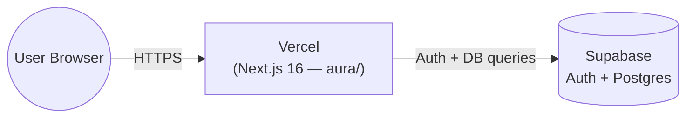

# Deployment Plan - Jewellery Age Advisor (Aura)

**Date**: 2026-09-29
**Author**: DEVOPS
**Based on**: `docs/deployment/discovery-report.md`, Helix Epic 9 (solution doc 4938)

---

## Target Architecture

**Serverless PaaS: Vercel.** No servers, containers, or cloud infrastructure to provision —
Vercel natively builds and hosts Next.js 16 apps from a connected GitHub repository. This matches
the discovery report and the Migration Document's Epic 9 spec.

## Environment Strategy

- **Production**: `main` branch → Vercel Production deployment (auto-triggered on every push to `main`, per Vercel's default GitHub integration behavior).
- **Preview**: any other branch or PR → Vercel automatically creates a unique preview URL. No explicit `staging` environment is configured — Vercel's preview deployments serve that purpose without extra setup.
- No CI pipeline is configured (per user direction) — Vercel's own build step (`next build`) is the only automated gate before a deployment goes live. `npm run lint`/`npm run test` are not run automatically pre-deploy; run them manually before pushing to `main` (already part of this session's established Story 7.x/Epic 8 practice).

## Secret Management

Vercel Project Settings → Environment Variables (encrypted at rest, injected at build/runtime):

| Variable | Value source | Scope |
|---|---|---|
| `NEXT_PUBLIC_SUPABASE_URL` | Same value as `aura/.env.local` | Production + Preview |
| `NEXT_PUBLIC_SUPABASE_ANON_KEY` | Same value as `aura/.env.local` | Production + Preview |
| `SUPABASE_SERVICE_ROLE_KEY` | Same value as `aura/.env.local` | **Do not add** unless a future feature needs it — currently unused by any code (confirmed in `docs/requirements.md`). If added later, mark it server-only (Vercel does not expose non-`NEXT_PUBLIC_*` vars to the browser bundle by default — this is already the safe default, just don't prefix it with `NEXT_PUBLIC_`) |

No external secrets manager needed for 2-3 variables at this scale.

## Rollback Strategy

Vercel keeps every previous deployment addressable and instantly promotable — no custom rollback
scripting needed:
1. Vercel dashboard → Deployments tab → find the last known-good deployment.
2. Click "..." → "Promote to Production" (or `vercel rollback` via CLI once installed).
3. No image/tag management required (unlike the self-hosted Docker rollback pattern in the DevOps rulebook) — Vercel's rollback is a dashboard action.

## Health Check Strategy

Vercel provides deployment-level build/runtime status natively (a failed build never goes live).
No custom `healthcheck.sh`/cron is needed for a serverless Next.js app with no long-running
process to monitor. Story 9.3's manual smoke test (below) is the functional health check for this
deployment.

## Infrastructure Naming Table

N/A — no infrastructure resources to name (no Terraform, no cloud resource groups/VPCs). The only
"naming" decision is the Vercel project name, which **you** choose during import (Story 9.1) —
suggest reusing the repo name (`-jewellery-age-advisor`) unless you prefer otherwise.

## Service Dependency Graph

```
User → Vercel (Next.js, aura/) → Supabase (Auth + Postgres, already provisioned)
```

Single dependency, already live and verified working throughout this session's Epic 7/8 work — no
deploy-order concerns.

## DNS

Not applicable yet — no custom domain requested. Vercel provides a free `*.vercel.app` subdomain
automatically on project creation; if a custom domain is added later, DNS records would need to be
configured manually by you (per the DevOps rulebook's DNS1 rule — never automated) and are outside
this plan's current scope.

---

## Runbook: Deploy (Stories 9.1 + 9.2)

### Story 9.1 — Push to GitHub and connect Vercel

1. **Push**: already done — this repo is on `main` at `https://github.com/argneshu/-jewellery-age-advisor`, up to date as of commit `557cbfb` (Epic 8 validation).
2. **Create/link Vercel project** (manual, in your browser — I cannot perform this):
   a. Go to https://vercel.com/new
   b. Import `argneshu/-jewellery-age-advisor` from GitHub (authorize Vercel's GitHub App if not already done).
   c. **Root Directory**: set to `aura` — the Next.js app lives in a subdirectory, not the repo root. This is the one non-default setting Vercel needs; everything else (framework preset, build command `next build`, output) is auto-detected.
   d. Do not override the build/install commands — Vercel's Next.js preset already runs `npm install` + `next build` correctly for this project (confirmed: no custom `vercel.json` needed).
   e. Click Deploy. The first build will fail or serve a broken app until Story 9.2's env vars are set — that's expected, not a defect.

### Story 9.2 — Configure environment variables and Supabase redirect URLs

1. In the Vercel project → Settings → Environment Variables, add:
   - `NEXT_PUBLIC_SUPABASE_URL` (Production + Preview)
   - `NEXT_PUBLIC_SUPABASE_ANON_KEY` (Production + Preview)
   - (Do NOT add `SUPABASE_SERVICE_ROLE_KEY` — unused, see Secret Management above)
2. Redeploy (Vercel → Deployments → "..." → Redeploy) so the build picks up the new env vars.
3. **Supabase redirect URLs** (needed for the email-confirmation callback from Epic 2/5):
   a. Go to your Supabase project → Authentication → URL Configuration.
   b. Add your Vercel production URL (e.g., `https://<your-project>.vercel.app`) and `https://<your-project>.vercel.app/auth/callback` to the allowed redirect URLs list.
   c. If you later add a custom domain, add that too.

---

## Runbook: Rollback

1. Vercel dashboard → your project → Deployments.
2. Find the last deployment that passed Story 9.3's smoke test.
3. Click "..." on that deployment → "Promote to Production".
4. Confirm the production URL now serves the rolled-back build (check the deployment's commit SHA matches).

## Runbook: Troubleshoot

| Symptom | Likely cause | Fix |
|---|---|---|
| Build fails with a Supabase env var error | Env vars not set yet, or set but not redeployed | Add vars in Settings → Environment Variables, then trigger a redeploy |
| App builds but `/login`/`/register` show a Supabase connection error | Wrong `NEXT_PUBLIC_SUPABASE_URL`/`ANON_KEY` values, or values from the wrong Supabase project | Re-check values against `aura/.env.local` (local dev) or the Supabase dashboard directly |
| Email confirmation link redirects to an error page | Production URL not added to Supabase's allowed redirect URLs (Story 9.2 step 3) | Add the exact Vercel URL + `/auth/callback` path to Supabase's redirect URL allowlist |
| `/favorites` or `/api/favorites` return 401 for a logged-in user in production but not locally | Session cookie domain mismatch, or redirect URLs misconfigured | Re-verify Story 9.2 step 3; confirm the Supabase project matches between local `.env.local` and Vercel's env vars |
| Deployment succeeds but shows a stale version | Browser/CDN cache | Hard refresh; Vercel's edge cache typically invalidates within seconds of a new deployment |

---

## Architecture Diagram



## Quick Reference

| Task | Command / Location |
|---|---|
| View production deployment | Vercel dashboard → your project → Deployments (Production tab) |
| View preview deployment for a branch/PR | Vercel dashboard → Deployments (auto-listed per branch) |
| Change env vars | Vercel → Settings → Environment Variables → redeploy after saving |
| Rollback | Vercel → Deployments → "..." → Promote to Production |
| Run tests locally before pushing | `cd aura && npm run test && npm run lint && npm run build` |

---

**Approval needed before I mark this plan as executed**: Stories 9.1 and 9.2 require you to act in
the Vercel/Supabase dashboards directly (account creation, GitHub App authorization, and
env-var/redirect-URL entry are not things I can do on your behalf). Once you've completed those
steps, tell me your production URL and I'll help run Story 9.3's smoke test checklist against it.
