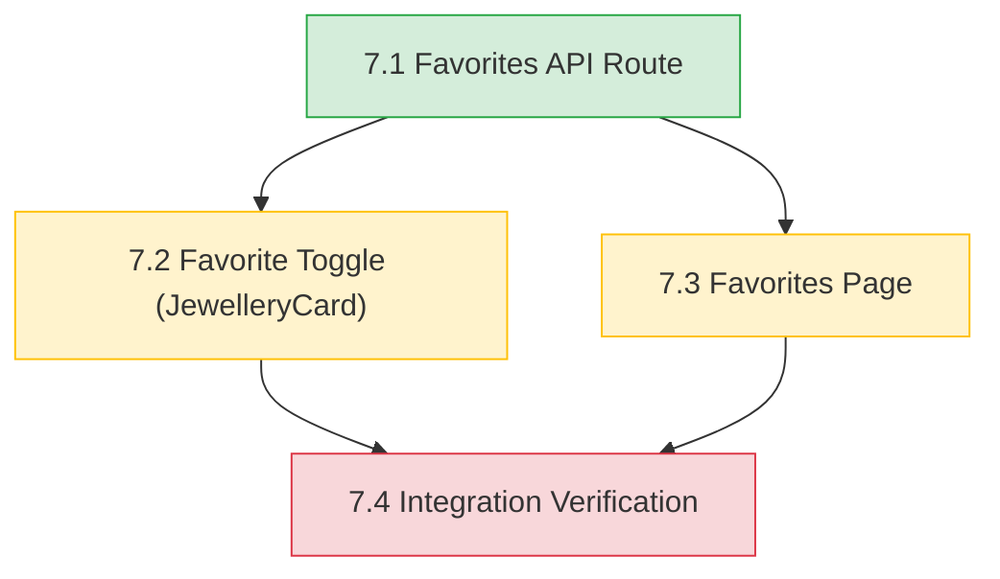
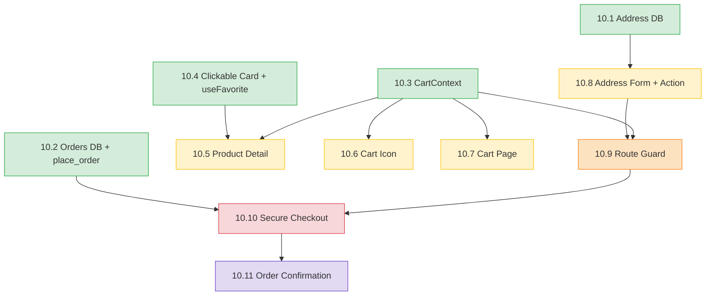

# Jewellery Age Advisor (Aura) - Implementation Plan

**Project**: Jewellery Age Advisor (Aura) — Favorites Completion | **Version**: 1.0 | **Created**: 2026-09-29
**Author**: PRODUCT_OWNER | **Status**: AWAITING

**Numbering note**: Epics 1-6 (historical, reconstructed from git history in `docs/requirements.md`)
map 1:1 to the Aura Migration Document's §8 Steps 1-6. This plan continues that sequence as
**Epic 7** = §8 Step 7 ("Add favorites"). Epics 8 and 9 (§8 Steps 8-9: verify against original
screenshots, deploy) are future work, not covered by this plan.

---

## Dependency Graph

**Wave Summary**

| Wave | Stories | Independent? | Notes |
|------|---------|---------------|-------|
| 1 | 7.1 | Root | Favorites API route — nothing else can start without it |
| 2 | 7.2, 7.3 | Yes — disjoint files | Frontend toggle and favorites page are independent of each other |
| 3 | 7.4 | No | Integration verification — requires both wave-2 stories done |

**Wave Workload Distribution** (team_size: 1)

| Wave | Stories | Per Dev | Dev Assignments | Notes |
|------|---------|---------|-------------------|-------|
| 1 | 1 | 1 | Dev-1: [7.1] | ✅ Active |
| 2 | 2 | 2 | Dev-1: [7.2, 7.3] | ✅ Active (solo dev takes both, in either order) |
| 3 | 1 | 1 | Dev-1: [7.4] | ✅ Active |

Full graph: `docs/plans/dependency-graph.yml`

---

## 1. Overview

**Success Criteria** (from `docs/requirements.md` and `docs/architecture/design/02-target-architecture-brownfield.md`):
1. `GET/POST/DELETE /api/favorites` implemented, authenticated, RLS-backed, matching the API contract in the target architecture.
2. `JewelleryCard` has a working favorite toggle: redirects guests to `/login`, calls the API for authenticated users.
3. `/favorites` renders the signed-in user's saved items in the existing results-grid visual style.
4. `npm run test`, `npm run lint`, `tsc --noEmit`, and `next build` all pass clean.
5. No regressions to existing recommendation, auth, or route-protection behavior.

**Epic Breakdown**:
- Epic 7: Favorites Completion (Migration Doc §8 Step 7) - Complete the favorites feature end-to-end (API → frontend toggle → page → verification), the one confirmed gap identified across discovery, deep-dive, requirements, target architecture, and patterns.

---

## EPIC 7: FAVORITES COMPLETION

**Owner**: DEV | **Goal**: Ship the favorites feature exactly as specified in the Aura Migration Document (§2, §5, §8 Step 6/7) and the approved target architecture — a working favorite/unfavorite flow backed by the existing `public.favorites` table and RLS.

**Must Read References**:
- `SPEC/references/Aura-Migration-Document-Vanilla-JS-Next.jsTypeScriptSupabase.md` — §2 (target file tree), §3.3 (schema/RLS), §5 (component table), §8 Step 6 (favorites plan)
- `docs/architecture/design/02-target-architecture-brownfield.md` — API contract, security design, technical decisions
- `docs/architecture/design/03-patterns-and-standards-brownfield.md` — error handling, API design, testing patterns

**Prerequisites**: `public.favorites` table + RLS (already exists, Epic 2 historical), `proxy.ts` route protection (already exists, Epic 5 historical), Supabase server/client helpers (already exist)
**Completion**: All 4 stories done; `npm run test`/`lint`/`build` clean; manual verification per Story 7.4 passes

---

### Story 7.1: Favorites API Route (GET/POST/DELETE)
**File**: `docs/plans/stories/epic-7-story-7.1-Favorites-API-Route.md`
One-line objective: Implement the authenticated `app/api/favorites/route.ts` handler backing all favorites reads/writes.

### Story 7.2: Favorite Toggle on JewelleryCard
**File**: `docs/plans/stories/epic-7-story-7.2-Favorite-Toggle-JewelleryCard.md`
One-line objective: Add a favorite/unfavorite control to `JewelleryCard` that redirects guests to `/login` and calls the new API for signed-in users.

### Story 7.3: Favorites Page — ✅ Done (2026-09-29)
**Tracked in Helix** (solution doc 4936) — implemented directly from the Helix spec; reviewed in `docs/stories-implemented/story-7.3-review.md`.
One-line objective: Build the protected `/favorites` page that lists the signed-in user's saved items in the existing card-grid style.

### Story 7.4: Favorites Feature Integration Verification — not a Helix story
This story was this repo's own local addition to `docs/plans/dependency-graph.yml`, not sourced
from Helix. Checking Helix's Epic 7 (solution doc 4936) confirmed it defines only 3 stories
(7.1–7.3) — Epic 7 is complete once those three are done. This story's intent (end-to-end
guest/auth/RLS-isolation verification) is instead covered by the "Next Steps" recommendation in
each of the 3 stories' review docs (a real interactive browser session), which is more honest
than manufacturing a 4th story with no source spec.

> **Note (2026-09-29)**: All 3 Helix-tracked stories (7.1, 7.2, 7.3) are implemented — Epic 7 is
> functionally complete. `docs/plans/dependency-graph.yml` still lists 4 stories for historical
> reference (it predates checking Helix's actual Epic 7 content), but only 7.1–7.3 correspond to
> real, spec-backed work.

---

## Quality Gates

**Per Story**: Patterns followed (per `docs/architecture/design/03-patterns-and-standards-brownfield.md`), tests pass, ESLint 0 errors, AC met, self-review
**Per Epic**: All 4 stories done, `npm run test`/`lint`/`build` pass, favorites feature works end-to-end, docs updated
**Final**: Epic 7 done, coverage ≥85% on new code, 0 ESLint errors, manual UAT (Story 7.4) passed

---

## Risks

| Risk | Impact | Mitigation |
|------|--------|------------|
| No existing test harness for Next.js Route Handlers or React components in this repo | M | Story 7.1/7.2 use mocked-`fetch` unit tests only (per patterns doc §8); flag component/route-handler test harness as a separate future improvement, not silently expanded here |
| `jewellery_item_id` has no DB foreign key to the static catalog | L | Story 7.3 must guard against a favorited id no longer present in `data/jewellery.ts` (e.g., filter out unresolvable ids rather than crashing) |
| RLS misconfiguration could leak cross-user favorites | H | Story 7.4's manual verification explicitly tests cross-user isolation before sign-off |

---

## Project Tracking

**Tracking**: GitHub Projects
**Repo**: argneshu/-jewellery-age-advisor

---
---

# Epic 10 — Aura Shopping Flow — Implementation Plan

**Project**: Jewellery Age Advisor (Aura) — Shopping Flow | **Version**: 1.0 | **Created**: 2026-10-08
**Author**: PRODUCT_OWNER | **Status**: AWAITING APPROVAL
**Source specs**: Helix solution 1080 (epic doc 5877 + stories 5878–5888; local snapshot `docs/helix/`), `docs/requirements.md` (Epic 10, approved), `docs/architecture/design/02-…` §10 (approved), `docs/architecture/design/03-…` §E10 (approved), `docs/data/*` (approved).
**Numbering**: Epics 1–9 exist (7 favorites, 8 verification, 9 deployment). This plan continues as **Epic 10** with local stories **10.1–10.11**; Helix story numbers are kept in each story header (`Helix: Story X.Y`). Tracker: **local only** (`Jira: LOCAL`, `GitHub: LOCAL`) with a Helix reference per story; nothing is written back to Helix.

## Prerequisite P0 (user action, before Story 10.1) — separate development database
Only one Supabase project exists and it is the production one. **Do not run migrations or tests against it.** Create a second (free) Supabase project, e.g. `aura-dev`, then: set `aura/.env.local` to the dev project's URL + anon key (never commit it); copy Auth settings (email confirmation required, Site URL, redirect URL `http://localhost:3000/auth/callback`); apply `0001_favorites.sql` there; create two test users. Production keeps its own keys (Vercel env vars, Epic 9). Production gets migrations 0002–0004 only at deploy time with explicit go-ahead + backup.

## Dependency Graph

**Wave Summary** (team_size: 1 — a wave is a set of stories that can be done in any order)

| Wave | Stories | Independent? | Notes |
|------|---------|--------------|-------|
| 4 | 10.1, 10.2, 10.3, 10.4 | Yes — disjoint files | DB (needs P0) + cart + clickable card |
| 5 | 10.5, 10.6, 10.7, 10.8 | Yes — disjoint files | Product page, header icon, cart page, address form |
| 6 | 10.9 | — | Route guard; creates guard-only `app/checkout/page.tsx` |
| 7 | 10.10 | — | Secure checkout; extends `app/checkout/page.tsx`, `lib/checkout.ts` |
| 8 | 10.11 | — | Confirmation page + full smoke test |

**Recommended order for one developer**: 10.3 → 10.4 → 10.1 → 10.2 → 10.5 → 10.6 → 10.7 → 10.8 → 10.9 → 10.10 → 10.11. (Putting the browser-only stories first gives a visible guest flow early; 10.1/10.2 need the dev database from P0 and the SQL test run.)

Full graph: `docs/plans/dependency-graph.yml`. Per-story files: `docs/plans/stories/epic-10-story-10.N-*.md`.

## 1. Overview

**Success Criteria**: see `docs/requirements.md` Epic 10 → "Success Criteria (Measurable)" (10 items). Summary: build/lint/tsc/tests green; coverage ≥85% on new `lib/` logic (`npm run test:coverage`); 40 product pages; guard matrix correct; COD + UPI orders created atomically with server-computed totals; RLS isolation; 12-step happy path passes.

**Epic Breakdown**:
- **Epic 10: Aura Shopping Flow** (11 stories, 25 Helix points) — one vertical feature: browse → product → cart → (login) → address → checkout → confirmation. Testable milestones: after 10.7 (guest can build a cart), after 10.9 (guard matrix), after 10.11 (full purchase).

**Deviation from the usual plan format (disclosed)**: story files are compact "deltas over Helix" rather than copies of the full Helix code, because Helix already holds the complete reference implementation and the user is tracking token usage; this mirrors how Story 7.3 was implemented. Full code is read from `docs/helix/documents/story-*.md` at implementation time.

## EPIC 10: AURA SHOPPING FLOW

**Owner**: DEV | **Goal**: Deliver the complete shopping flow with server-side price integrity, atomic orders and RLS-protected personal data.
**Must Read References**: `docs/requirements.md` (Epic 10), `docs/architecture/design/02-target-architecture-brownfield.md` §10, `docs/architecture/design/03-patterns-and-standards-brownfield.md` §E10, `docs/data/data-model-epic10.md`, the story's Helix document.
**Prerequisites**: P0 (dev Supabase project); `@vitest/coverage-v8` installed (done).
**Completion**: all 11 stories done; gates green; DB tests pasted; 12-step smoke test passed; production migration + deploy decided separately.

### Story 10.1: Address DB Migration — Helix 3.1
**File**: `docs/plans/stories/epic-10-story-10.1-Address-DB-Migration.md` — Create `user_addresses` (+RLS, CHECKs) and `types/address.ts`; apply to dev only.
### Story 10.2: Orders DB Migration (+ `place_order`) — Helix 4.1
**File**: `docs/plans/stories/epic-10-story-10.2-Orders-DB-Migration-and-place_order.md` — `orders`, `order_items`, atomic `place_order()`; run the 14-test SQL script.
### Story 10.3: Cart State Management (CartContext) — Helix 2.1
**File**: `docs/plans/stories/epic-10-story-10.3-Cart-State-Management-CartContext.md` — pure cart logic + provider with safe hydration.
### Story 10.4: Clickable Jewellery Card — Helix 1.1
**File**: `docs/plans/stories/epic-10-story-10.4-Clickable-Jewellery-Card.md` — Link wrapper + `useFavorite` extraction.
### Story 10.5: Product Detail Page — Helix 1.2
**File**: `docs/plans/stories/epic-10-story-10.5-Product-Detail-Page.md` — 40 static pages with Add to Cart + heart.
### Story 10.6: Cart Icon in Header — Helix 2.2
**File**: `docs/plans/stories/epic-10-story-10.6-Cart-Icon-in-Header.md` — header bag icon + badge.
### Story 10.7: Cart Page — Helix 2.3
**File**: `docs/plans/stories/epic-10-story-10.7-Cart-Page.md` — cart list, steppers, summary, checkout button.
### Story 10.8: Address Form & Server Action — Helix 3.2
**File**: `docs/plans/stories/epic-10-story-10.8-Address-Form-and-Server-Action.md` — address page/form/`saveAddress` + validation.
### Story 10.9: Checkout Route Guard — Helix 3.3
**File**: `docs/plans/stories/epic-10-story-10.9-Checkout-Route-Guard.md` — proxy protection + guard-only checkout page.
### Story 10.10: Secure Checkout Page — Helix 4.2
**File**: `docs/plans/stories/epic-10-story-10.10-Secure-Checkout-Page.md` — checkout UI, server pricing/validation, `place_order`.
### Story 10.11: Order Confirmation Page — Helix 4.3
**File**: `docs/plans/stories/epic-10-story-10.11-Order-Confirmation-Page.md` — confirmation page + final smoke test.
### Story 10.7a: Show product photos on cart & checkout — Enhancement 1 (sub-story of 10.7)
**File**: `docs/plans/stories/enhancement-epic-10-story-10.7a-show-product-photos-in-cart-and-checkout.md` — shared `ProductImage` component; photos in cart rows and checkout order summary. Report: `docs/enhancements/enhancement-1.md`.

## Quality Gates
**Per Story**: patterns followed (§E10), TDD for pure logic, tests pass (existing + new), ESLint 0 errors, `tsc --noEmit`, `next build`, AC met, review doc in `docs/stories-implemented/story-10.N-review.md` with pasted output, `docs/status.md` updated.
**Per Wave/Epic**: all stories done, `npm run test:coverage` ≥85% on new `lib/` modules, SQL verification output pasted (after 10.2), `aire-review-code` then `aire-qa-validate`.
**Final**: 12-step Helix smoke test; regression run; production migration + deployment only on explicit user go-ahead.

## Risks

| Risk | Impact | Mitigation |
|------|--------|------------|
| Only a production Supabase project exists | H | P0: create a dev project; never test against production |
| SQL/verification script not yet executed | H | 10.1/10.2 gate: run on dev (Docker or Supabase) and fix `docs/data/` first |
| DB cannot verify catalog prices (R1) | M (L today, H with real payments) | App-side pricing now; DB price table before real payments |
| `JewelleryCard` anchor-wrap a11y / Epic 7 regression | M | 10.4 keeps existing tests green + manual keyboard check |
| No component test harness | M | Logic in pure `lib/` modules; manual/QA evidence for UI |
| Account deletion cascades to orders (AD-D3) | M later | Revisit before real sales |
| Epic 9 production deploy still pending | M | Production migration + Story 9.3 smoke test extended after dev verification |

## Project Tracking
**Tracking**: local (`docs/status.md` Story Tracker); stories mirrored in Helix solution 1080 (read-only reference). **Repo**: argneshu/-jewellery-age-advisor

## QA Manual Testing Groups

### Epic 10: Aura Shopping Flow

**Group 1** — Stories: 10.3, 10.4, 10.5, 10.6, 10.7
As a **guest**, QA can browse recommendations, click a card, open a product page, add items, see the header badge update, open the cart, change quantities, remove items, refresh and keep the cart, and see “Proceed to Checkout” send a guest to login. Heart clicks must not navigate (mouse and keyboard); signed-in favorites still work.

**Group 2** — Stories: 10.1 `[backend]`, 10.8, 10.9
As a **signed-in user** (dev project), QA can follow the routing matrix (no address → address form; address → checkout; guest → login), save and edit an address with valid and invalid values, and see the address pre-filled afterwards. 10.1 provides the table and its isolation; user B must never see user A's address.

**Group 3** — Stories: 10.2 `[backend]`, 10.10, 10.11
As a **signed-in user with an address**, QA can place a COD order and a UPI order, see the cart cleared and the confirmation page with correct items/total/address, confirm that an empty cart cannot be ordered, that tampering with prices in the browser does not change the stored total, that double-clicking creates one order, and that another user gets a 404 for the order link. 10.2 provides the atomic order function and the SQL isolation tests.
