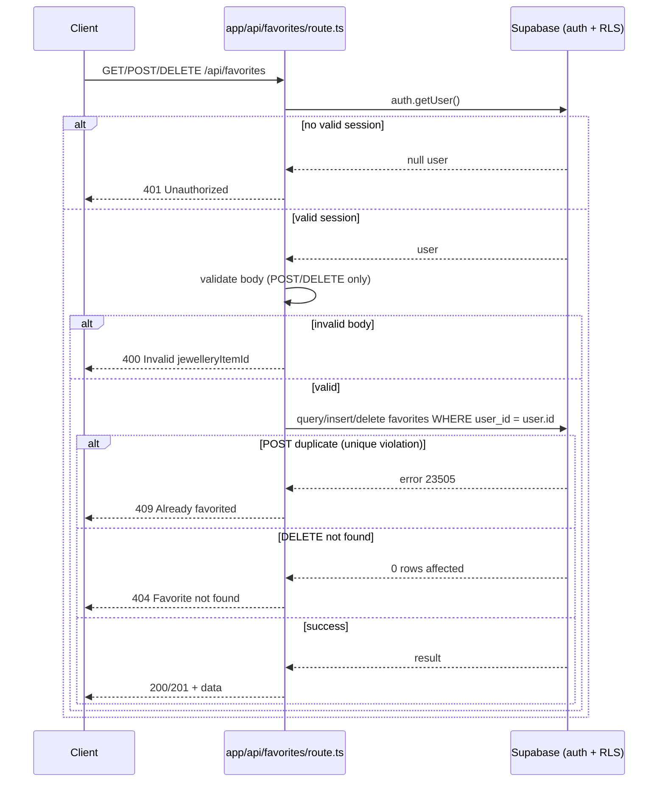

### Story 1.1: Favorites API Route (GET/POST/DELETE)

**File**: `docs/plans/stories/epic-1-story-1.1-Favorites-API-Route.md`

**Epic**: 1 - FAVORITES COMPLETION | **ID**: 1.1 | **Date**: 2026-09-29 | **Jira**: LOCAL | **GitHub**: LOCAL
**Wave**: 1
**Requires**: []
**Enables**: [1.2, 1.3]
**Files Touched**:
  - aura/app/api/favorites/route.ts
  - aura/.env.example
**Roles Ref**: docs/requirements.md#roles--permissions-matrix — personas this story differentiates: [Guest, Authenticated User]
**QA Candidate**: Yes — **Observable:** three new HTTP endpoints (`GET`/`POST`/`DELETE /api/favorites`) that read/write a signed-in user's favorites. **Mechanism:** each handler calls `supabase.auth.getUser()` then queries/mutates `public.favorites` scoped to that user's id via the server Supabase client (RLS also enforces this at the DB layer). **Authz & preconditions:** Authenticated User only; Guest gets 401 from every method even if `proxy.ts` were misconfigured. **Edge/idempotency:** duplicate `POST` returns 409 (unique constraint), repeat `DELETE` on an already-removed favorite returns 404, malformed body returns 400. **Regression:** must not weaken existing RLS policies or the `proxy.ts` route-protection matcher; existing recommendation/auth flows must be unaffected since this touches no shared file outside this route.

#### 👤 User Reference

**Description**:
Today, saving a piece of jewellery to look at later doesn't work — there's no way for the app to remember what a signed-in user liked, even though the database already has a `favorites` table sitting there ready to use. This story turns on the "memory" behind favoriting: it adds the three basic operations a signed-in user needs — see everything I've favorited, add a new favorite, and remove one — all scoped so a user only ever sees their own list, never anyone else's. A guest (someone not signed in) can't use any of this; trying to reach these operations directly is refused. This story is API-only — no button, toggle, or page shows up yet — it's laying the plumbing that Stories 1.2 and 1.3 will connect a real "heart" button and a "My Favorites" page to.

**Acceptance Criteria** (plain-English bullets):
- A signed-in user can request their full list of favorited items and get back exactly the items they've favorited, never another user's.
- A signed-in user can favorite a jewellery item they haven't favorited yet, and the system confirms it was saved.
- Trying to favorite the same item twice tells the user it's already favorited, rather than silently creating a duplicate or crashing.
- A signed-in user can remove one of their favorites, and the system confirms it was removed.
- Trying to remove something that was never favorited (or was already removed) tells the user it wasn't found, rather than pretending it succeeded.
- Sending a nonsense/malformed request (e.g., no item specified) is rejected with a clear "invalid" message, not a server error.
- None of this works for someone who isn't signed in — every attempt is refused the same way a protected page already refuses guests today.

**User Flow**:

### [Authenticated User]
**Scenario / narrative**: As a signed-in user, I want to list, add, and remove my favorites. I call `GET /api/favorites` and get back only the items I've saved — never anyone else's, even if I somehow guessed another user's data existed. When I favorite an item I haven't saved before, the system confirms it. If I try to favorite something I already saved, it tells me that plainly instead of creating a second copy or silently succeeding. When I remove a favorite, it's gone; trying to remove it again (or something I never saved) tells me it isn't there.
**Steps**:
1. Authenticated User's client calls `GET /api/favorites` with their session cookie attached automatically.
2. The server confirms the session belongs to a real signed-in user, then looks up only that user's saved rows.
3. The server returns the list; an empty list (no favorites yet) is a normal, valid response — not an error.
4. To add one, the client calls `POST /api/favorites` with the item's id; the server checks it's not already saved, then saves it and confirms.
5. To remove one, the client calls `DELETE /api/favorites` with the item's id; the server removes it if present, or tells the client it wasn't found.

### [Guest]
**Scenario / narrative**: As a guest browsing without an account, I never see a favorite option in the UI (that's Story 1.2), but even if I tried to call these endpoints directly (e.g., from the browser console), the server refuses every one of them the same way it already refuses guest access to `/favorites` today — no data is ever returned or changed.
**Steps**:
1. Guest's request to any of `GET`/`POST`/`DELETE /api/favorites` arrives with no valid session.
2. The server checks for a signed-in user first, before touching any data, and finds none.
3. The server refuses the request outright; nothing is read or written.

**Flow Diagram**:



---

#### 🤖 AI Agent Reference

**Must Read**:
- `SPEC/references/Aura-Migration-Document-Vanilla-JS-Next.jsTypeScriptSupabase.md` — §3.3 (schema/RLS, already applied), §4.4 (defense-in-depth auth pattern)
- `docs/architecture/design/02-target-architecture-brownfield.md` — API Changes section (exact request/response contracts), Security Design
- `docs/architecture/design/03-patterns-and-standards-brownfield.md` — §6 API Design Pattern (DO/DON'T), §3 Error Handling, §7 Configuration

**Description**:
Implements `aura/app/api/favorites/route.ts` as a Next.js App Router Route Handler exporting `GET`, `POST`, and `DELETE`. Each handler independently authenticates via `supabase.auth.getUser()` (server client from `lib/supabase/server.ts`) — this is required even though `proxy.ts` already blocks unauthenticated requests to this path, per the Migration Document's explicit defense-in-depth requirement (§4.4) and the target architecture's Security Design. All database operations go through the authenticated user's Supabase client so RLS (`auth.uid() = user_id`) applies automatically — never use a service-role client here. This story also adds `aura/.env.example` documenting the two required env vars, per the Patterns doc's Configuration Pattern (§7) new-adoption decision.

**Design Tokens**: N/A — no UI in this story.

**Acceptance Criteria** (comprehensive):
- [ ] `GET /api/favorites` returns `200` + `FavoriteRecord[]` (as typed in `types/auth.ts`) scoped to `auth.getUser()`'s id, for an authenticated request.
- [ ] `GET /api/favorites` returns `200` + `[]` when the user has no favorites (not an error).
- [ ] `GET /api/favorites` returns `401 { error: "Unauthorized" }` when no session is present.
- [ ] `POST /api/favorites` with `{ jewelleryItemId: number }` returns `201` + the created `FavoriteRecord` when not already favorited.
- [ ] `POST /api/favorites` with an already-favorited `jewelleryItemId` returns `409 { error: "Already favorited" }` (unique constraint violation, Postgres code `23505`), not a 500 and not a silent success.
- [ ] `POST /api/favorites` with a non-numeric or missing `jewelleryItemId` returns `400 { error: "Invalid jewelleryItemId" }` before any DB call.
- [ ] `POST /api/favorites` returns `401` when unauthenticated.
- [ ] `DELETE /api/favorites` with `{ jewelleryItemId: number }` returns `200 { removed: true }` when a matching favorite existed and was removed.
- [ ] `DELETE /api/favorites` with a `jewelleryItemId` that was never favorited (or already removed) returns `404 { error: "Favorite not found" }`.
- [ ] `DELETE /api/favorites` with a non-numeric/missing `jewelleryItemId` returns `400`.
- [ ] `DELETE /api/favorites` returns `401` when unauthenticated.
- [ ] Every query is scoped by `user_id = user.id` from the authenticated session — never from a client-supplied field.
- [ ] `aura/.env.example` lists `NEXT_PUBLIC_SUPABASE_URL` and `NEXT_PUBLIC_SUPABASE_ANON_KEY`, with a commented-out `SUPABASE_SERVICE_ROLE_KEY` noted as not currently used.

**RBAC Enforcement**:

| Persona | Permission key | Guarded route/endpoint | Allowed | Denied behavior | UI when denied |
|---------|----------------|--------------------------|---------|-------------------|------------------|
| Authenticated User | favorites:read-own | GET /api/favorites | own rows only | n/a | n/a (API-only story) |
| Authenticated User | favorites:create-own | POST /api/favorites | own rows only | 409 on duplicate | n/a |
| Authenticated User | favorites:delete-own | DELETE /api/favorites | own rows only | 404 if not found | n/a |
| Guest | — | GET/POST/DELETE /api/favorites | no | 401 on every method | n/a (no UI in this story; Story 1.2 hides the trigger) |

- **Enforcement point(s)**: top of each exported handler in `aura/app/api/favorites/route.ts` — `const { data: { user } } = await supabase.auth.getUser(); if (!user) return Response.json({ error: "Unauthorized" }, { status: 401 });` — also independently backed by `proxy.ts`'s existing matcher and by RLS at the DB layer (three independent layers, per the target architecture's defense-in-depth decision).
- **Denied-access contract**: `401 { error: "Unauthorized" }` JSON body; no UI in this story (pure API).
- **Scope derivation (object-level authz)**: `user_id` for every query/mutation comes from `user.id` returned by `supabase.auth.getUser()` — never from the request body or query string. The request body only ever supplies `jewelleryItemId`; it must never be trusted to supply or override `user_id`. This is the IDOR guard — combined with RLS as a second independent enforcement layer.

**System responses + error cases**:

| Trigger | Response | Side-effect |
|---------|----------|-------------|
| `GET` with valid session, has favorites | `200` + `FavoriteRecord[]` | none (read-only) |
| `GET` with valid session, no favorites | `200` + `[]` | none |
| `GET` with no/invalid session | `401 { error: "Unauthorized" }` | none |
| `POST` valid session + new `jewelleryItemId` | `201` + created record | one row inserted into `public.favorites` |
| `POST` valid session + already-favorited `jewelleryItemId` (idempotent-repeat case) | `409 { error: "Already favorited" }` | none — no duplicate row |
| `POST` valid session + malformed body | `400 { error: "Invalid jewelleryItemId" }` | none |
| `POST` with no/invalid session | `401` | none |
| `DELETE` valid session + existing favorite | `200 { removed: true }` | one row deleted |
| `DELETE` valid session + non-existent favorite (idempotent-repeat case) | `404 { error: "Favorite not found" }` | none |
| `DELETE` valid session + malformed body | `400` | none |
| `DELETE` with no/invalid session | `401` | none |

**QA-observable behaviour**:
- `GET /api/favorites` as User A never returns User B's rows, even when both have favorited the same `jewelleryItemId` (verify via two distinct test users/sessions).
- After a successful `POST`, exactly one row exists in `public.favorites` for that `(user_id, jewelleryItemId)` pair; a second identical `POST` does not create a second row (unique constraint holds) and returns `409`.
- After a successful `DELETE`, `GET` no longer includes that item; repeating the same `DELETE` returns `404`, not a false `200`.
- **What does NOT change**: no other user's favorites, no rows in any other table, and no change to the `public.favorites` schema or RLS policies (already correct from Epic 2).

**Prerequisites**: `public.favorites` table + RLS policies (exist, Epic 2 historical), `lib/supabase/server.ts` (exists), `types/auth.ts` `FavoriteRecord` type (exists), `proxy.ts` matcher already includes `/api/favorites` (exists, Epic 5 historical).

**Context**: `aura/lib/supabase/server.ts`, `aura/types/auth.ts`, `aura/supabase/migrations/0001_favorites.sql`, `aura/components/auth/AuthHeader.tsx` (reference for the `createClient()` + `auth.getUser()` pattern).

**Patterns**: API Design Pattern, Error Handling Pattern, Database Access Pattern, Configuration Pattern — see `docs/architecture/design/03-patterns-and-standards-brownfield.md` §3, §5, §6, §7.

**Steps**:

1. Create `aura/app/api/favorites/route.ts` with the `GET` handler:
   ```typescript
   import { createClient } from "@/lib/supabase/server";

   export async function GET() {
     const supabase = await createClient();
     const { data: { user } } = await supabase.auth.getUser();
     if (!user) {
       return Response.json({ error: "Unauthorized" }, { status: 401 });
     }

     const { data, error } = await supabase
       .from("favorites")
       .select("*")
       .eq("user_id", user.id);

     if (error) {
       return Response.json({ error: error.message }, { status: 500 });
     }
     return Response.json(data);
   }
   ```

2. Add the `POST` handler in the same file:
   ```typescript
   export async function POST(request: Request) {
     const supabase = await createClient();
     const { data: { user } } = await supabase.auth.getUser();
     if (!user) {
       return Response.json({ error: "Unauthorized" }, { status: 401 });
     }

     const body = await request.json();
     if (typeof body.jewelleryItemId !== "number") {
       return Response.json({ error: "Invalid jewelleryItemId" }, { status: 400 });
     }

     const { data, error } = await supabase
       .from("favorites")
       .insert({ user_id: user.id, jewellery_item_id: body.jewelleryItemId })
       .select()
       .single();

     if (error) {
       if (error.code === "23505") {
         return Response.json({ error: "Already favorited" }, { status: 409 });
       }
       return Response.json({ error: error.message }, { status: 500 });
     }

     return Response.json(data, { status: 201 });
   }
   ```

3. Add the `DELETE` handler in the same file:
   ```typescript
   export async function DELETE(request: Request) {
     const supabase = await createClient();
     const { data: { user } } = await supabase.auth.getUser();
     if (!user) {
       return Response.json({ error: "Unauthorized" }, { status: 401 });
     }

     const body = await request.json();
     if (typeof body.jewelleryItemId !== "number") {
       return Response.json({ error: "Invalid jewelleryItemId" }, { status: 400 });
     }

     const { data, error } = await supabase
       .from("favorites")
       .delete()
       .eq("user_id", user.id)
       .eq("jewellery_item_id", body.jewelleryItemId)
       .select();

     if (error) {
       return Response.json({ error: error.message }, { status: 500 });
     }
     if (!data || data.length === 0) {
       return Response.json({ error: "Favorite not found" }, { status: 404 });
     }

     return Response.json({ removed: true });
   }
   ```

4. Create `aura/.env.example`:
   ```bash
   NEXT_PUBLIC_SUPABASE_URL=
   NEXT_PUBLIC_SUPABASE_ANON_KEY=
   # Not currently used by any code in this repo — add only if a future
   # feature needs elevated (RLS-bypassing) server-side access:
   # SUPABASE_SERVICE_ROLE_KEY=
   ```

**Tests**:

```typescript
// This repo has no Next.js Route Handler test harness today (confirmed in
// deep-dive) — per the Risks section, this story does not introduce one.
// Manual verification (curl) is the primary test for this story; automated
// coverage of the favorites flow is added in Story 1.2 via lib/favorites.ts's
// unit tests (mocked fetch), which exercise this route's contract indirectly.
```

Manual:
1. Sign in as User A via the existing login flow; `curl` `GET /api/favorites` with the session cookie → expect `200 []`.
2. `curl -X POST /api/favorites -d '{"jewelleryItemId": 17}'` → expect `201` + record.
3. Repeat the same `POST` → expect `409 { error: "Already favorited" }`.
4. `curl -X POST /api/favorites -d '{}'` → expect `400`.
5. `curl -X DELETE /api/favorites -d '{"jewelleryItemId": 17}'` → expect `200 { removed: true }`.
6. Repeat the same `DELETE` → expect `404`.
7. `curl GET/POST/DELETE /api/favorites` with no session cookie → expect `401` on all three.
8. Sign in as User B, favorite item 17, then `GET /api/favorites` as User A → confirm User A's list does not include User B's favorite (cross-user isolation).

**Quality**: ESLint 0 errors, `tsc --noEmit` clean, manual verification above passes, no console errors.

**OUT**: ❌ No UI in this story (toggle button is Story 1.2, page is Story 1.3). ❌ No repository/class abstraction over Supabase calls. ❌ No new logging library. ❌ No rate limiting (flagged as a separate open question in `docs/requirements.md`, not in scope here).

**Evidence**: curl output for all 8 manual test cases above, `tsc --noEmit` clean output, ESLint clean output.
