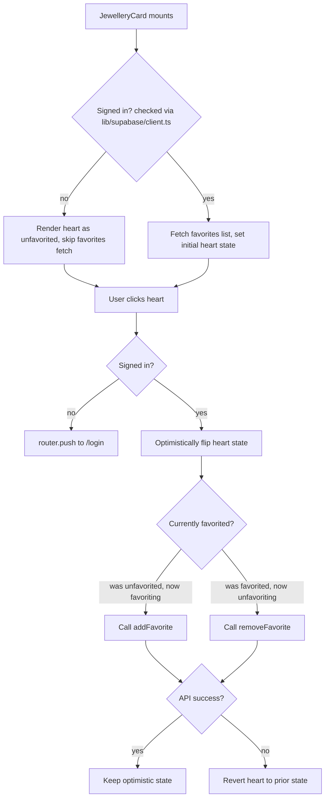

### Story 7.2: Favorite Toggle on JewelleryCard

**File**: `docs/plans/stories/epic-7-story-7.2-Favorite-Toggle-JewelleryCard.md`

**Epic**: 7 - FAVORITES COMPLETION | **ID**: 7.2 | **Date**: 2026-09-29 | **Jira**: LOCAL | **GitHub**: LOCAL
**Wave**: 2
**Requires**: [7.1]
**Enables**: [7.4]
**Files Touched**:
  - aura/lib/favorites.ts
  - aura/lib/favorites.test.ts
  - aura/components/recommendations/JewelleryCard.tsx
**Roles Ref**: docs/requirements.md#roles--permissions-matrix — personas this story differentiates: [Guest, Authenticated User]
**QA Candidate**: Yes — **Observable:** a heart-shaped toggle on every `JewelleryCard` that reflects and changes the signed-in user's favorite status for that item. **Mechanism:** `lib/favorites.ts` wraps `fetch` calls to `/api/favorites` (built in Story 7.1); the card checks auth client-side (`lib/supabase/client.ts`) and, if signed in, fetches current favorite status on mount and calls add/remove on click. **Authz & preconditions:** Guest clicking the toggle is redirected to `/login` instead of calling the API; Authenticated User's toggle calls the real API. **Edge/idempotency:** a failed add/remove reverts the optimistic UI state; rapid double-click doesn't produce two conflicting requests landing out of order. **Regression:** must not change `JewelleryCard`'s existing image/gradient/why-text rendering, and must not break `ResultsGrid`'s layout.

#### 👤 User Reference

**Description**:
This story puts an actual "favorite" button on every jewellery card — the heart icon you'd expect on any shopping app. If you're signed in, tapping the heart saves that piece to your favorites (Story 7.1's API does the actual saving); tapping an already-favorited heart un-saves it. The heart also shows the correct state when the page loads — if you already favorited something on a previous visit, it shows as favorited right away, not as a surprise toggle you have to click twice. If you're not signed in, tapping the heart doesn't try to save anything (which would fail anyway) — it takes you straight to the login page instead, so you understand why nothing happened and can sign in to try again. If saving or removing fails for any reason (e.g., a network hiccup), the heart visually reverts to its previous state rather than showing an incorrect "saved" state that isn't actually true.

**Acceptance Criteria** (plain-English bullets):
- Every jewellery card shows a heart icon.
- A signed-in user who has already favorited an item sees the heart already filled in when the page loads.
- Clicking an empty heart (signed in) fills it in and saves the item.
- Clicking a filled heart (signed in) empties it and removes the item.
- A guest clicking the heart is taken to the login page — nothing is saved, no error is shown, it's a clear "sign in to do this" moment.
- If saving/removing fails, the heart's visual state goes back to what it was before the click — the user never sees a "successful" heart that doesn't reflect reality.
- The rest of the card (image/gradient, name, price, why-text) looks and works exactly as it did before this change.

**User Flow**:

### [Authenticated User]
**Scenario / narrative**: As a signed-in user browsing recommendations, I see a heart icon on each card. If I've already favorited an item on a previous visit, its heart is already filled in when the page loads — I don't have to guess or re-click. I tap an empty heart on a new item I like; it fills in immediately and the item is saved. If I change my mind, I tap it again and it empties and un-saves. If my connection drops mid-tap, the heart reverts to its prior state so I'm not misled into thinking something saved that didn't.
**Steps**:
1. On mount, the card checks the browser session (`lib/supabase/client.ts`) to confirm the user is signed in.
2. If signed in, it calls the favorites list to determine whether this specific item is already favorited, and sets the heart's initial visual state accordingly.
3. On click, the card optimistically flips the heart's visual state immediately (for responsiveness), then calls the add or remove API in the background.
4. If the API call succeeds, the optimistic state is confirmed (no visible change).
5. If the API call fails, the heart reverts to its pre-click state.

### [Guest]
**Scenario / narrative**: As a guest browsing without an account, I see the same heart icon as anyone else (no different visual treatment needed to reveal my auth state), but tapping it doesn't try to save anything — it recognizes I'm not signed in and takes me to the login page instead, the same way clicking into `/favorites` directly would.
**Steps**:
1. On mount, the card checks the browser session and finds no signed-in user; the heart renders in its default (unfavorited) visual state without calling the favorites API at all.
2. On click, the card redirects to `/login` instead of calling any favorites endpoint.

**Flow Diagram**:



---

#### 🤖 AI Agent Reference

**Must Read**:
- `docs/architecture/design/02-target-architecture-brownfield.md` — Technical Decision #1 (why `lib/favorites.ts` exists as a shared helper)
- `docs/architecture/design/03-patterns-and-standards-brownfield.md` — §8 Unit Test pattern (mocked `fetch`), §3 Error Handling
- `aura/components/auth/LoginForm.tsx`, `aura/components/auth/LogoutButton.tsx` — existing `"use client"` + `lib/supabase/client.ts` pattern to mirror

**Description**:
Adds `aura/lib/favorites.ts` with three functions (`listFavorites`, `addFavorite`, `removeFavorite`) that wrap `fetch` calls to the Story 7.1 API, matching the client-helper pattern decided in the target architecture (Technical Decision #1). Modifies `aura/components/recommendations/JewelleryCard.tsx` to add a heart toggle: on mount, check auth state via the existing browser Supabase client (same pattern as `LoginForm`), and if signed in, call `listFavorites()` to determine this item's initial state. On click, redirect guests to `/login`; for signed-in users, optimistically flip state and call `addFavorite`/`removeFavorite`, reverting on failure. Use the `Heart` icon from `lucide-react` (already a dependency) — filled when favorited, outline when not.

**Design Tokens** (FE):
- Icon: `lucide-react`'s `Heart` component, `size={20}` to match the card's existing icon-less minimal chrome.
- Favorited color: `text-rose` (existing Tailwind token, matches the "rose-gold" brand color already used for the gradient Button variant) with `fill-rose`.
- Unfavorited color: `text-ink-soft` (existing token, matches other secondary text/icon treatments), no fill.
- Placement: top-right corner of the card's image/gradient block (`absolute top-3 right-3`), consistent with common product-card conventions and not overlapping existing content (category label, name, price, why-text all live in `CardContent` below the image block).
- Button hit target: minimum 32x32px (accessibility — matches existing `Button` size="sm" dimensions).

**Acceptance Criteria** (comprehensive):
- [ ] `lib/favorites.ts` exports `listFavorites(): Promise<FavoriteRecord[]>`, `addFavorite(jewelleryItemId: number): Promise<FavoriteRecord>`, `removeFavorite(jewelleryItemId: number): Promise<void>`.
- [ ] Each function throws an `Error` with the API's `error` message on a non-2xx response.
- [ ] `JewelleryCard` renders a `Heart` icon button on every card, regardless of auth state.
- [ ] On mount, if the browser client reports no signed-in user, the card does NOT call `listFavorites()` — renders unfavorited by default.
- [ ] On mount, if signed in, the card calls `listFavorites()` once and sets its own favorited state based on whether its `item.id` appears in the result.
- [ ] Clicking the heart while signed out calls `router.push("/login")` and does not call any favorites function.
- [ ] Clicking the heart while signed in and currently unfavorited: UI flips to favorited immediately, then calls `addFavorite(item.id)`.
- [ ] Clicking the heart while signed in and currently favorited: UI flips to unfavorited immediately, then calls `removeFavorite(item.id)`.
- [ ] If the add/remove call throws, the UI reverts to its pre-click state (no permanent "stuck" incorrect state).
- [ ] Existing card rendering (image/gradient fallback, category, name, price, `whyText`) is unchanged — this story only adds the heart control.

**RBAC Enforcement**:

| Persona | Permission key | Guarded route/endpoint | Allowed | Denied behavior | UI when denied |
|---------|----------------|--------------------------|---------|-------------------|------------------|
| Authenticated User | favorites:read-own | (client calls) GET /api/favorites | yes | n/a | heart reflects real state |
| Authenticated User | favorites:create-own / favorites:delete-own | (client calls) POST/DELETE /api/favorites | yes | n/a (API-level 409/404 handled by lib/favorites.ts throwing, caught by the card's revert logic) | heart toggles |
| Guest | — | N/A — client never calls the API | n/a | redirected client-side, no API call attempted | clicking heart navigates to /login |

- **Enforcement point(s)**: actual authorization is enforced server-side in Story 7.1's route handler + RLS — this story's client-side auth check is a UX convenience (avoid a pointless API round-trip and 401 for guests), not a security boundary. The security boundary remains Story 7.1's server-side check.
- **Denied-access contract**: guest never reaches the API; if a signed-in user's session expires mid-interaction, the underlying `fetch` returns 401 and `lib/favorites.ts` throws — the card's existing revert-on-failure logic handles this the same as any other failure (reverts the optimistic UI state).
- **Scope derivation**: N/A at this layer — `lib/favorites.ts` never sends a user identifier; the server derives it from the session cookie (Story 7.1).

**System responses + error cases**:

| Trigger | Response | Side-effect |
|---------|----------|-------------|
| Mount, signed out | No API call | Heart renders unfavorited |
| Mount, signed in, item not in favorites list | `listFavorites()` resolves | Heart renders unfavorited |
| Mount, signed in, item in favorites list | `listFavorites()` resolves | Heart renders favorited |
| Click, signed out | `router.push("/login")` | No API call, no state change |
| Click, signed in, currently unfavorited (happy path) | `addFavorite` resolves | Heart stays favorited (optimistic state confirmed) |
| Click, signed in, currently favorited (happy path) | `removeFavorite` resolves | Heart stays unfavorited (optimistic state confirmed) |
| Click, signed in, `addFavorite` throws (e.g., network error or unexpected 409 from a stale local state) | Heart reverts to unfavorited | No persistent visual lie |
| Click, signed in, `removeFavorite` throws (e.g., unexpected 404 from a stale local state) | Heart reverts to favorited | No persistent visual lie |
| Rapid double-click (idempotency concern) | Second click's optimistic flip is based on the just-updated local state, so two clicks toggle twice, not the same direction twice — matches user intent | At most one in-flight request per click; no request cancellation needed for this scope (flagged in OUT) |

**QA-observable behaviour**:
- A signed-in user who favorited item 17 in a previous session sees item 17's heart pre-filled on next page load, without clicking anything.
- Clicking favorite → refresh the page (or re-mount) → heart is still filled (confirms the add actually persisted via Story 7.1's API, not just local state).
- Simulate an API failure (e.g., mock `fetch` to reject) → heart visually reverts within the same interaction, no lingering "favorited" state that isn't backed by the server.
- **What does NOT change**: the card's image/gradient block, category/name/price/why-text rendering, and `ResultsGrid`'s overall grid layout are pixel-identical to before this story for a signed-out user (whose heart always renders unfavorited).

**Prerequisites**: Story 7.1 complete (API route must exist and work).

**Context**: `aura/components/recommendations/JewelleryCard.tsx`, `aura/lib/supabase/client.ts`, `aura/components/auth/LoginForm.tsx` (auth-check pattern reference), `aura/types/auth.ts` (`FavoriteRecord`).

**Patterns**: API Design Pattern (client-side consumer), Error Handling Pattern, Unit Test Pattern — see `docs/architecture/design/03-patterns-and-standards-brownfield.md` §6, §3, §8.

**Steps**:

1. Create `aura/lib/favorites.ts`:
   ```typescript
   import type { FavoriteRecord } from "@/types/auth";

   async function parseOrThrow(response: Response) {
     if (!response.ok) {
       const body = await response.json().catch(() => ({ error: "Request failed" }));
       throw new Error(body.error ?? "Request failed");
     }
     return response.json();
   }

   export async function listFavorites(): Promise<FavoriteRecord[]> {
     const response = await fetch("/api/favorites");
     return parseOrThrow(response);
   }

   export async function addFavorite(jewelleryItemId: number): Promise<FavoriteRecord> {
     const response = await fetch("/api/favorites", {
       method: "POST",
       headers: { "Content-Type": "application/json" },
       body: JSON.stringify({ jewelleryItemId }),
     });
     return parseOrThrow(response);
   }

   export async function removeFavorite(jewelleryItemId: number): Promise<void> {
     const response = await fetch("/api/favorites", {
       method: "DELETE",
       headers: { "Content-Type": "application/json" },
       body: JSON.stringify({ jewelleryItemId }),
     });
     await parseOrThrow(response);
   }
   ```

2. Modify `aura/components/recommendations/JewelleryCard.tsx` to add `"use client"` state for the toggle (file is already a client component via `useState` for `imageFailed`):
   ```typescript
   import { useEffect, useState } from "react";
   import { useRouter } from "next/navigation";
   import { Heart } from "lucide-react";
   import { createClient } from "@/lib/supabase/client";
   import { listFavorites, addFavorite, removeFavorite } from "@/lib/favorites";

   // Inside JewelleryCard, alongside the existing imageFailed state:
   const router = useRouter();
   const [isFavorited, setIsFavorited] = useState(false);
   const [isSignedIn, setIsSignedIn] = useState(false);

   useEffect(() => {
     let cancelled = false;
     async function checkAuthAndFavorite() {
       const supabase = createClient();
       const { data: { user } } = await supabase.auth.getUser();
       if (cancelled) return;
       setIsSignedIn(!!user);
       if (!user) return;

       const favorites = await listFavorites().catch(() => []);
       if (cancelled) return;
       setIsFavorited(favorites.some((f) => f.jewelleryItemId === item.id));
     }
     checkAuthAndFavorite();
     return () => { cancelled = true; };
   }, [item.id]);

   async function handleToggleFavorite() {
     if (!isSignedIn) {
       router.push("/login");
       return;
     }
     const nextState = !isFavorited;
     setIsFavorited(nextState); // optimistic
     try {
       if (nextState) {
         await addFavorite(item.id);
       } else {
         await removeFavorite(item.id);
       }
     } catch {
       setIsFavorited(!nextState); // revert on failure
     }
   }
   ```

3. Add the heart button to the card's JSX, inside the image block:
   ```tsx
   <button
     type="button"
     onClick={handleToggleFavorite}
     className="absolute right-3 top-3 flex h-8 w-8 items-center justify-center rounded-full bg-ivory/80"
     aria-label={isFavorited ? "Remove from favorites" : "Add to favorites"}
   >
     <Heart
       size={20}
       className={isFavorited ? "fill-rose text-rose" : "text-ink-soft"}
     />
   </button>
   ```

**Tests**:

```typescript
// aura/lib/favorites.test.ts
import { describe, expect, it, vi, beforeEach } from "vitest";
import { addFavorite, removeFavorite, listFavorites } from "@/lib/favorites";

describe("lib/favorites", () => {
  beforeEach(() => {
    vi.restoreAllMocks();
  });

  it("listFavorites returns the parsed favorites array", async () => {
    vi.stubGlobal("fetch", vi.fn().mockResolvedValue({
      ok: true,
      json: async () => [{ id: "1", userId: "u1", jewelleryItemId: 17, createdAt: "2026-01-01" }],
    }));
    const result = await listFavorites();
    expect(result).toHaveLength(1);
    expect(result[0].jewelleryItemId).toBe(17);
  });

  it("addFavorite posts jewelleryItemId and returns the created record", async () => {
    const mockFetch = vi.fn().mockResolvedValue({
      ok: true,
      json: async () => ({ id: "1", userId: "u1", jewelleryItemId: 17, createdAt: "2026-01-01" }),
    });
    vi.stubGlobal("fetch", mockFetch);

    const result = await addFavorite(17);

    expect(mockFetch).toHaveBeenCalledWith("/api/favorites", expect.objectContaining({
      method: "POST",
      body: JSON.stringify({ jewelleryItemId: 17 }),
    }));
    expect(result.jewelleryItemId).toBe(17);
  });

  it("addFavorite throws with the API's error message on a 409", async () => {
    vi.stubGlobal("fetch", vi.fn().mockResolvedValue({
      ok: false,
      json: async () => ({ error: "Already favorited" }),
    }));
    await expect(addFavorite(17)).rejects.toThrow("Already favorited");
  });

  it("removeFavorite throws with the API's error message on a 404", async () => {
    vi.stubGlobal("fetch", vi.fn().mockResolvedValue({
      ok: false,
      json: async () => ({ error: "Favorite not found" }),
    }));
    await expect(removeFavorite(17)).rejects.toThrow("Favorite not found");
  });
});
```

Manual:
1. Sign in, view `/results`, confirm no items show as favorited initially.
2. Click a heart → confirm it fills in immediately; refresh the page → confirm it's still filled (persisted).
3. Click the same heart again → confirm it empties; refresh → confirm it stays empty.
4. Sign out, view `/results`, click any heart → confirm redirect to `/login`, no console errors.
5. With devtools network throttled/offline, click a heart → confirm it reverts to its prior state after the failed request.

**Quality**: ESLint 0 errors, `tsc --noEmit` clean, `npm run test` passes with ≥85% coverage on `lib/favorites.ts`, no console errors, no visual regression to existing card layout.

**OUT**: ❌ No request cancellation/debouncing for rapid clicks beyond the natural optimistic-state ordering described above. ❌ No shared/cached favorites list across cards (each card independently calls `listFavorites()` on mount — acceptable for a 6-item grid; a shared context/cache is a future optimization, not required here). ❌ No component-level automated test for `JewelleryCard` itself (no React component test harness exists in this repo yet, per the patterns doc's stated gap) — covered by `lib/favorites.ts` unit tests plus the manual test cases above.

**Evidence**: `npm run test` output showing `lib/favorites.test.ts` passing with coverage, manual test case results (1-5 above), screenshot of a favorited vs. unfavorited card.
